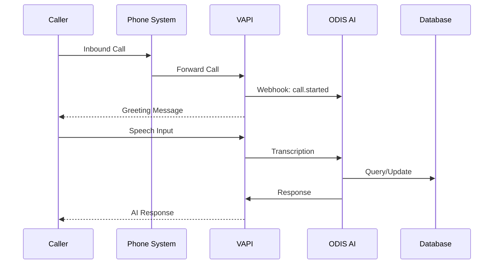

# VAPI Integration

ODIS AI is powered by VAPI (Voice API), a cutting-edge platform for building conversational AI voice agents.

## Overview

VAPI handles the core voice interactions for ODIS AI, including:

- Real-time speech-to-text transcription
- Natural language understanding
- Text-to-speech synthesis
- Call management and routing

## How It Works



## Configuration

### Assistant Setup

Each ODIS AI agent maps to a VAPI assistant with specific configurations:

```typescript
const assistantConfig = {
  name: "ODIS Inbound Agent",
  voice: {
    provider: "11labs",
    voiceId: "sarah",
  },
  model: {
    provider: "openai",
    model: "gpt-4o",
  },
  firstMessage: "Thank you for calling. How can I help you today?",
};
```

### Webhook Events

ODIS AI listens for these VAPI webhook events:

| Event                | Description                |
| -------------------- | -------------------------- |
| `call.started`       | Call initiated             |
| `call.ended`         | Call completed             |
| `transcript.update`  | Real-time transcription    |
| `tool.call`          | Function execution request |
| `end-of-call-report` | Full call summary          |

## Best Practices

1. **Keep responses concise** - Voice interactions should be brief and clear
2. **Handle interruptions** - Allow callers to interrupt the AI naturally
3. **Provide clear options** - Guide callers with explicit choices
4. **Graceful fallback** - Transfer to human when AI is uncertain
