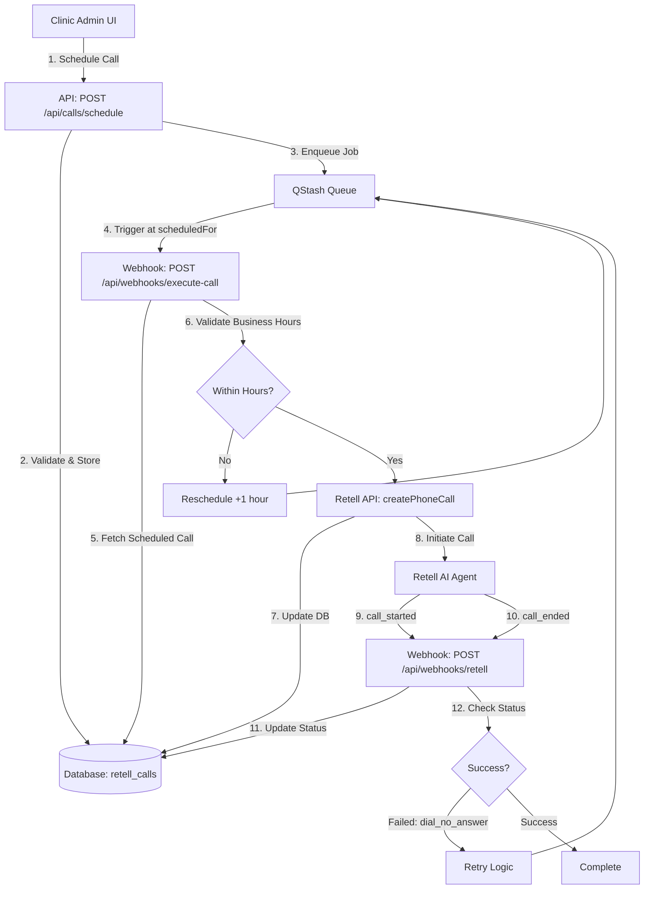

# Retell AI Scheduled Calls - Complete Architecture Documentation

> **Document Purpose**: Comprehensive end-to-end architecture guide for scheduling Retell AI calls in advance
>
> **Date**: 2025-11-08
> **Status**: Architecture Design & Implementation Guide
> **Author**: System Architecture Analysis

---

## Table of Contents

1. [Executive Summary](#executive-summary)
2. [Browser Extension Integration](#browser-extension-integration)
3. [Current State Analysis](#current-state-analysis)
4. [Architecture Overview](#architecture-overview)
5. [Database Schema](#database-schema)
6. [System Components](#system-components)
7. [API Endpoints](#api-endpoints)
8. [Webhook & Event Flow](#webhook--event-flow)
9. [Queue Service Integration](#queue-service-integration)
10. [Business Logic & Rules](#business-logic--rules)
11. [Error Handling & Retry Logic](#error-handling--retry-logic)
12. [Security & Access Control](#security--access-control)
13. [Implementation Roadmap](#implementation-roadmap)
14. [Testing Strategy](#testing-strategy)
15. [Deployment Guide](#deployment-guide)
16. [Monitoring & Observability](#monitoring--observability)

---

## Executive Summary

### Purpose

This system enables veterinary clinics to schedule discharge follow-up calls in advance, automating the process of calling pet owners to check on their pets after hospital visits. The **entry point is a browser extension** that integrates directly into the IDEXX Neo practice management system, allowing veterinarians to schedule calls with a single click while reviewing patient consultations.

### Key Features

- **IDEXX Neo Integration**: Browser extension captures consultation data directly from IDEXX Neo
- **One-Click Scheduling**: Auto-populate patient data (name, phone, provider, discharge notes) from active consultation
- **Advance Scheduling**: Schedule calls hours, days, or weeks in advance
- **Business Hours Enforcement**: Automatic scheduling within configurable business hours (e.g., 9 AM - 5 PM)
- **Retry Logic**: Automatic retries for failed calls (busy, no answer, etc.)
- **Patient Context**: Rich patient data passed to AI agent (pet name, owner, discharge summary)
- **Queue-Based Execution**: Reliable delayed job execution using QStash
- **Real-Time Updates**: Webhook-driven status updates
- **Admin Controls**: Full CRUD operations for scheduled calls via web dashboard

### Architecture Pattern

```
┌──────────────────┐     ┌─────────────────┐     ┌──────────────┐
│  IDEXX Neo       │────▶│  Browser Ext    │────▶│  Your API    │
│  (Consultation)  │     │  (Capture Data) │     │  (Schedule)  │
└──────────────────┘     └─────────────────┘     └──────────────┘
                                                          │
                                                          ▼
┌──────────────┐      ┌─────────────┐      ┌──────────────┐
│  Database    │◀─────│  Validate   │◀─────│  Transform   │
│  (Pending)   │      │  & Store    │      │  IDEXX Data  │
└──────────────┘      └─────────────┘      └──────────────┘
        │
        │ Enqueue
        ▼
┌──────────────┐
│   QStash     │
│   (Queue)    │
└──────────────┘
        │ (Timer Expires)
        ▼
┌──────────────┐      ┌──────────────┐      ┌──────────────┐
│   Webhook    │─────▶│  Retell AI   │─────▶│   Webhook    │
│   Handler    │      │  (Execute)   │      │   Handler    │
│  (Execute)   │      │              │      │   (Status)   │
└──────────────┘      └──────────────┘      └──────────────┘
        │                                            │
        └─────────────────▶ Database ◀──────────────┘
                           (Update)
```

---

## Browser Extension Integration

### Overview

The primary entry point for scheduling calls is a **browser extension** (Chrome/Firefox) that integrates with IDEXX Neo, the veterinary practice management system. When a veterinarian is viewing a consultation in IDEXX Neo, they can click the extension icon to automatically schedule a follow-up call using the current patient's data.

### IDEXX Neo Data Source

**API Endpoint**: `https://us.idexxneo.com/consultations/[consultation_id]/page-data`

**Authentication**: Uses the veterinarian's active IDEXX Neo session (cookies)

**Response Structure**:

```json
{
  "pageData": {
    "providers": [
      {
        "id": 1004,
        "name": "Dr. K Chaudhary",
        "email": "drkchaudhary@gmail.com",
        "licenseNumber": "CA 18432",
        "userType": "Vet",
        "companyId": 7742
      }
    ],
    "patient": {
      "name": "Luna",
      "species": "Canine",
      "breed": "Labrador Retriever"
    },
    "client": {
      "name": "Sarah Johnson",
      "phone": "+14155551234",
      "email": "sarah.j@email.com"
    },
    "consultation": {
      "id": 12345,
      "reason": "Post-surgery follow-up",
      "notes": "Spay procedure completed. Monitor incision...",
      "dischargeSummary": "Post-op care instructions..."
    },
    "clinic": {
      "name": "Paws & Claws Veterinary Hospital",
      "phone": "+14155559876"
    }
  }
}
```

### Extension Workflow

1. **User Action**: Veterinarian clicks extension icon while viewing consultation
2. **Data Capture**: Extension fetches `/consultations/[id]/page-data` via authenticated request
3. **Data Transformation**: Extension maps IDEXX data to your API format
4. **Pre-fill Form**: Extension displays popup with pre-populated call details
5. **User Confirmation**: Veterinarian reviews/edits details and selects scheduling time
6. **API Call**: Extension sends POST request to your API (`/api/calls/schedule`)
7. **Confirmation**: Extension shows success message with scheduled call details

### Data Mapping

**IDEXX Neo → Your API**:

```typescript
// Extension code (manifest v3)
const idexxData = await fetchConsultationData(consultationId);

const callRequest = {
  phoneNumber: idexxData.pageData.client.phone,
  petName: idexxData.pageData.patient.name,
  ownerName: idexxData.pageData.client.name,
  vetName: idexxData.pageData.providers[0].name, // Primary provider
  clinicName: idexxData.pageData.clinic.name,
  clinicPhone: idexxData.pageData.clinic.phone,
  dischargeSummary: idexxData.pageData.consultation.dischargeSummary,
  scheduledFor: userSelectedTime, // From date/time picker
  notes: `Consultation #${consultationId} - ${idexxData.pageData.consultation.reason}`,

  // Metadata for tracking
  metadata: {
    source: "idexx_neo",
    consultation_id: consultationId,
    provider_id: idexxData.pageData.providers[0].id,
    company_id: idexxData.pageData.companyId,
  },
};

// Send to your API
const response = await fetch("https://your-domain.com/api/calls/schedule", {
  method: "POST",
  headers: {
    "Content-Type": "application/json",
    Authorization: `Bearer ${userAuthToken}`, // From your auth system
  },
  body: JSON.stringify(callRequest),
});
```

### Extension Components

**manifest.json**:

```json
{
  "manifest_version": 3,
  "name": "ODIS AI - Discharge Call Scheduler",
  "version": "1.0.0",
  "permissions": ["activeTab", "storage"],
  "host_permissions": [
    "https://us.idexxneo.com/*",
    "https://your-domain.com/*"
  ],
  "action": {
    "default_popup": "popup.html",
    "default_icon": "icons/icon128.png"
  },
  "content_scripts": [
    {
      "matches": ["https://us.idexxneo.com/consultations/*"],
      "js": ["content.js"]
    }
  ],
  "background": {
    "service_worker": "background.js"
  }
}
```

**Key Files**:

- `popup.html` - UI for scheduling call (date/time picker, review data)
- `content.js` - Injected into IDEXX Neo pages to extract consultation ID
- `background.js` - Handles API requests and authentication
- `idexx-adapter.js` - Transforms IDEXX data to your API format

### Security Considerations

1. **CORS**: Your API must allow requests from `chrome-extension://[extension-id]`
2. **Authentication**: Extension stores user's auth token (from your system) in Chrome storage
3. **IDEXX Session**: Extension uses existing IDEXX cookies (user must be logged into IDEXX)
4. **Data Privacy**: Extension never stores patient data locally, only in-memory during request

### Extension Distribution

- **Internal Use**: Load unpacked extension in Chrome developer mode
- **Private Listing**: Publish to Chrome Web Store (unlisted) for clinic staff only
- **Auto-Updates**: Chrome Web Store handles updates automatically

---

## Current State Analysis

### What Exists Today

#### ✅ Database Infrastructure

**Table: `retell_calls`**

- Stores all call records (both immediate and scheduled)
- Contains `status` field with values: `scheduled`, `initiated`, `in_progress`, `completed`, `failed`, `cancelled`
- Has `retell_call_id` (temporary ID for scheduled calls, real ID after execution)
- Includes `call_variables` (patient data), `metadata` (notes, scheduled_for)
- RLS policies enforce user-based access control

**Key Columns:**

```sql
retell_calls (
  id UUID PRIMARY KEY,
  retell_call_id VARCHAR UNIQUE, -- "scheduled_*" prefix for pending calls
  agent_id VARCHAR,
  phone_number VARCHAR,
  phone_number_pretty VARCHAR,
  call_variables JSONB, -- {pet_name, owner_name, vet_name, clinic_name, discharge_summary_content}
  metadata JSONB, -- {notes, scheduled_for}
  status VARCHAR CHECK (status IN ('scheduled', 'initiated', 'ringing', 'in_progress', 'completed', 'failed', 'cancelled')),
  created_by UUID REFERENCES auth.users(id),
  created_at TIMESTAMPTZ DEFAULT NOW(),
  -- Webhook data populated after call execution
  recording_url TEXT,
  transcript TEXT,
  transcript_object JSONB,
  call_analysis JSONB,
  disconnection_reason TEXT
)
```

#### ✅ Server Actions

**File: `src/server/actions/retell.ts`**

1. **`sendCall()`** - Immediate call execution
   - Creates call via Retell API immediately
   - Stores in DB with status "initiated"

2. **`scheduleCall()`** - Save for later ⚠️ PARTIAL
   - Saves to DB with status "scheduled"
   - Does NOT trigger actual call
   - Missing: Queue integration for delayed execution

3. **`initiateScheduledCall()`** - Manual execution
   - Fetches scheduled call from DB
   - Calls Retell API
   - Updates DB with Retell response

4. **`fetchCalls()` / `fetchCall()`** - Read operations
   - List all calls with filters
   - Get single call details with fresh Retell data

#### ✅ Webhook Handler

**File: `src/app/api/webhooks/retell/route.ts`**

- Receives `call_started`, `call_ended`, `call_analyzed` events
- Updates database with real-time call status
- Maps Retell status to internal status
- Uses service client to bypass RLS

#### ✅ UI Components

**File: `src/components/dashboard/scheduled-calls-section.tsx`**

- Displays scheduled calls in a dedicated section
- "Call Now" button triggers `initiateScheduledCall()`
- Shows pet name, owner, phone number, notes

#### ✅ Validation Schemas

**File: `src/lib/retell/validators.ts`**

```typescript
scheduleCallSchema = {
  phoneNumber: phoneNumberSchema,
  petName: string().min(1),
  ownerName: string().min(1),
  vetName: string().optional(),
  clinicName: string().optional(),
  clinicPhone: string().optional(),
  dischargeSummary: string().optional(),
  scheduledFor: date().optional(), // ⚠️ Currently not used for automation
  notes: string().optional(),
};
```

### What's Missing (Gaps)

#### ❌ Automated Execution

- **No queue service** to trigger calls at scheduled time
- Calls remain in "scheduled" status indefinitely until manually initiated

#### ❌ Business Hours Validation

- No enforcement of calling hours (e.g., 9 AM - 5 PM)
- No timezone handling for multi-region clinics

#### ❌ Retry Logic

- No automatic retries for failed calls (dial_no_answer, dial_busy)
- No exponential backoff or maximum retry limits

#### ❌ Scheduled Time Management

- `scheduledFor` field exists but isn't used
- No UI calendar/time picker for selecting future times
- No validation to prevent past-date scheduling

#### ❌ Queue Webhook Security

- No signature verification for queue-triggered webhooks
- Potential security vulnerability for delayed job execution

#### ❌ Monitoring & Alerts

- No alerts for stuck scheduled calls
- No metrics on scheduling success rate

---

## Architecture Overview

### System Design Principles

1. **Separation of Concerns**
   - **Scheduling Layer**: User creates schedule, stores in DB
   - **Execution Layer**: Queue service triggers execution at scheduled time
   - **Status Layer**: Webhooks update status in real-time

2. **Idempotency**
   - Queue jobs can be retried safely
   - Duplicate webhook events don't corrupt state

3. **Fault Tolerance**
   - Failed calls automatically retry with backoff
   - Dead letter queue for permanently failed jobs

4. **Observability**
   - Comprehensive logging at each stage
   - Metrics for scheduling, execution, and completion rates

### Component Diagram



### Data Flow

**Phase 1: Scheduling**

```
User Input → Validation → DB Insert (status: scheduled) → QStash Enqueue → Confirmation
```

**Phase 2: Execution** (triggered by QStash at scheduled time)

```
QStash Trigger → Webhook → Fetch from DB → Business Hours Check → Retell API → DB Update
```

**Phase 3: Status Updates** (real-time via Retell webhooks)

```
Retell Event → Webhook → Status Mapping → DB Update → UI Refresh
```

---

## Database Schema

### Current Schema (Existing)

```sql
-- Already exists in migration 20251105081112
CREATE TABLE IF NOT EXISTS public.retell_calls (
  id UUID PRIMARY KEY DEFAULT gen_random_uuid(),
  retell_call_id VARCHAR UNIQUE NOT NULL,
  agent_id VARCHAR NOT NULL,
  phone_number VARCHAR NOT NULL CHECK (phone_number ~ '^\+?[1-9]\d{1,14}$'),
  phone_number_pretty VARCHAR,
  call_variables JSONB DEFAULT '{}'::jsonb,
  metadata JSONB DEFAULT '{}'::jsonb,
  status VARCHAR NOT NULL DEFAULT 'initiated'
    CHECK (status IN ('scheduled', 'initiated', 'ringing', 'in_progress', 'completed', 'failed', 'cancelled')),

  -- Timing
  created_at TIMESTAMPTZ DEFAULT NOW(),
  updated_at TIMESTAMPTZ DEFAULT NOW(),
  start_timestamp TIMESTAMPTZ,
  end_timestamp TIMESTAMPTZ,
  duration_seconds INTEGER,

  -- Retell response data
  retell_response JSONB,
  recording_url TEXT,
  transcript TEXT,
  transcript_object JSONB,
  call_analysis JSONB,
  disconnection_reason TEXT,
  public_log_url TEXT,
  error_message TEXT,

  -- Access control
  created_by UUID REFERENCES auth.users(id),
  patient_id UUID REFERENCES public.call_patients(id)
);

-- Indexes for performance
CREATE INDEX idx_retell_calls_status ON public.retell_calls(status);
CREATE INDEX idx_retell_calls_created_by ON public.retell_calls(created_by);
CREATE INDEX idx_retell_calls_created_at ON public.retell_calls(created_at DESC);
CREATE INDEX idx_retell_calls_retell_id ON public.retell_calls(retell_call_id);
```

### Recommended Schema Additions

#### ✅ Already Supported via `metadata` JSONB

The following fields can be stored in the existing `metadata` column:

```typescript
// metadata structure for scheduled calls
{
  scheduled_for: "2025-11-10T14:00:00Z", // ISO 8601 timestamp
  notes: "Post-surgery follow-up",
  retry_count: 0,
  max_retries: 3,
  next_retry_at: "2025-11-10T15:00:00Z",
  qstash_message_id: "msg_abc123xyz", // QStash tracking
  timezone: "America/Los_Angeles" // User's timezone
}
```

#### ⚠️ Optional: Dedicated Columns (If Needed)

If you frequently query by `scheduled_for`, consider adding a dedicated column:

```sql
-- Migration: add_scheduled_for_column
ALTER TABLE public.retell_calls
ADD COLUMN scheduled_for TIMESTAMPTZ;

-- Index for efficient querying of upcoming scheduled calls
CREATE INDEX idx_retell_calls_scheduled_for
ON public.retell_calls(scheduled_for)
WHERE status = 'scheduled';

-- Update existing records
UPDATE public.retell_calls
SET scheduled_for = (metadata->>'scheduled_for')::timestamptz
WHERE metadata->>'scheduled_for' IS NOT NULL;
```

**Recommendation**: Start with `metadata` JSONB. Only add dedicated column if you need:

- Complex date range queries
- Performance optimization for large datasets (>100K scheduled calls)

---

## System Components

### 1. API Routes

#### `POST /api/calls/schedule`

**Purpose**: Create a new scheduled call

**Location**: `src/app/api/calls/schedule/route.ts` (NEW FILE NEEDED)

**Request Body**:

```typescript
{
  phoneNumber: "+12137774445",
  petName: "Luna",
  ownerName: "Sarah Johnson",
  vetName: "Dr. Smith",
  clinicName: "Paws & Claws Veterinary",
  clinicPhone: "+14155551234",
  dischargeSummary: "Post-op instructions...",
  scheduledFor: "2025-11-10T14:00:00Z", // ISO 8601
  notes: "Follow-up on surgery recovery",
  timezone: "America/Los_Angeles" // Optional, default to clinic settings
}
```

**Response**:

```typescript
{
  success: true,
  data: {
    callId: "uuid-here",
    scheduledFor: "2025-11-10T14:00:00Z",
    qstashMessageId: "msg_abc123xyz"
  }
}
```

**Implementation Steps**:

1. Validate admin access
2. Parse and validate input (use `scheduleCallSchema`)
3. Validate `scheduledFor` is in future
4. Validate `scheduledFor` is within business hours (configurable)
5. Create DB record with status "scheduled"
6. Enqueue job in QStash with delay
7. Return confirmation

---

#### `POST /api/webhooks/execute-call`

**Purpose**: Execute scheduled call (triggered by QStash)

**Location**: `src/app/api/webhooks/execute-call/route.ts` (NEW FILE NEEDED)

**Authentication**: QStash signature verification

**Request Headers**:

```
Upstash-Signature: <signature>
Upstash-Message-Id: msg_abc123xyz
```

**Request Body**:

```typescript
{
  callId: "uuid-of-scheduled-call";
}
```

**Response**:

```typescript
{
  success: true,
  message: "Call executed successfully",
  retellCallId: "retell_call_id_here"
}
```

**Implementation Steps**:

1. Verify QStash signature (CRITICAL SECURITY)
2. Fetch scheduled call from DB by `callId`
3. Validate status is still "scheduled" (prevent double execution)
4. Check current time is within business hours
   - If NO: Reschedule to next available slot, return 200
   - If YES: Continue to step 5
5. Call Retell API (`createPhoneCall`)
6. Update DB with Retell response
7. Return success

---

### 2. Queue Service (QStash)

#### Why QStash?

- **Serverless-Native**: No infrastructure management
- **Delay Support**: Native support for delayed job execution
- **Reliability**: Automatic retries with exponential backoff
- **Dead Letter Queue**: Failed jobs moved to DLQ after max retries
- **Signature Verification**: Built-in webhook security
- **Vercel Integration**: Official support for Vercel deployments

#### Setup Instructions

**1. Install QStash SDK**

```bash
pnpm add @upstash/qstash
```

**2. Get QStash Credentials**

1. Sign up at [Upstash Console](https://console.upstash.com/)
2. Navigate to QStash
3. Copy credentials:
   - `QSTASH_URL`
   - `QSTASH_TOKEN`
   - `QSTASH_CURRENT_SIGNING_KEY`
   - `QSTASH_NEXT_SIGNING_KEY`

**3. Add to `.env.local`**

```bash
# QStash Configuration
QSTASH_URL=https://qstash.upstash.io
QSTASH_TOKEN=your_token_here
QSTASH_CURRENT_SIGNING_KEY=your_current_key
QSTASH_NEXT_SIGNING_KEY=your_next_key
```

**4. Create QStash Client**

**File**: `src/lib/qstash/client.ts` (NEW FILE)

```typescript
import { Client } from "@upstash/qstash";

export const qstashClient = new Client({
  token: process.env.QSTASH_TOKEN!,
});

/**
 * Schedule a call for delayed execution
 */
export async function scheduleCallExecution(
  callId: string,
  scheduledFor: Date,
): Promise<string> {
  const delay = Math.floor((scheduledFor.getTime() - Date.now()) / 1000); // seconds

  if (delay < 0) {
    throw new Error("Cannot schedule call in the past");
  }

  const webhookUrl = `${process.env.NEXT_PUBLIC_SITE_URL}/api/webhooks/execute-call`;

  const response = await qstashClient.publishJSON({
    url: webhookUrl,
    body: { callId },
    delay, // seconds until execution
    retries: 3, // Retry up to 3 times if webhook fails
    headers: {
      "Content-Type": "application/json",
    },
  });

  return response.messageId;
}
```

---

### 3. Webhook Handlers

#### Execute Call Webhook (QStash → App)

**File**: `src/app/api/webhooks/execute-call/route.ts` (NEW FILE)

```typescript
import { NextRequest, NextResponse } from "next/server";
import { verifySignature } from "@upstash/qstash/dist/nextjs";
import { createServiceClient } from "~/lib/supabase/server";
import { createPhoneCall } from "~/lib/retell/client";
import {
  isWithinBusinessHours,
  getNextBusinessHourSlot,
} from "~/lib/utils/business-hours";
import { scheduleCallExecution } from "~/lib/qstash/client";

/**
 * Execute a scheduled call
 * Triggered by QStash at the scheduled time
 */
async function handler(req: NextRequest) {
  try {
    const { callId } = await req.json();

    // Get Supabase service client (bypass RLS)
    const supabase = await createServiceClient();

    // Fetch scheduled call
    const { data: call, error } = await supabase
      .from("retell_calls")
      .select("*")
      .eq("id", callId)
      .eq("status", "scheduled")
      .single();

    if (error || !call) {
      return NextResponse.json(
        { error: "Scheduled call not found" },
        { status: 404 },
      );
    }

    // Check business hours
    const scheduledTime = new Date(call.metadata?.scheduled_for);
    const timezone = call.metadata?.timezone ?? "America/Los_Angeles";

    if (!isWithinBusinessHours(scheduledTime, timezone)) {
      // Reschedule to next available slot
      const nextSlot = getNextBusinessHourSlot(scheduledTime, timezone);

      // Update DB
      await supabase
        .from("retell_calls")
        .update({
          metadata: {
            ...call.metadata,
            scheduled_for: nextSlot.toISOString(),
            rescheduled_reason: "outside_business_hours",
          },
        })
        .eq("id", callId);

      // Re-enqueue in QStash
      const messageId = await scheduleCallExecution(callId, nextSlot);

      return NextResponse.json({
        success: true,
        message: "Rescheduled to next business hour",
        nextScheduledFor: nextSlot.toISOString(),
        qstashMessageId: messageId,
      });
    }

    // Execute call via Retell API
    const fromNumber = process.env.RETELL_FROM_NUMBER;
    const agentId = call.agent_id || process.env.RETELL_AGENT_ID;

    const response = await createPhoneCall({
      from_number: fromNumber!,
      to_number: call.phone_number,
      override_agent_id: agentId!,
      retell_llm_dynamic_variables: call.call_variables,
      metadata: call.metadata,
      retries_on_no_answer: 2,
    });

    // Update DB with Retell response
    await supabase
      .from("retell_calls")
      .update({
        retell_call_id: response.call_id,
        agent_id: response.agent_id,
        status: mapRetellStatus(response.call_status),
        start_timestamp: response.start_timestamp
          ? new Date(response.start_timestamp * 1000).toISOString()
          : null,
        retell_response: response as unknown,
      })
      .eq("id", callId);

    return NextResponse.json({
      success: true,
      message: "Call executed successfully",
      retellCallId: response.call_id,
    });
  } catch (error) {
    console.error("Execute call webhook error:", error);
    return NextResponse.json(
      { error: "Internal server error" },
      { status: 500 },
    );
  }
}

// Wrap with QStash signature verification
export const POST = verifySignature(handler);

export async function GET() {
  return NextResponse.json({
    status: "ok",
    message: "Execute call webhook is active",
  });
}

function mapRetellStatus(retellStatus: string): string {
  const statusMap: Record<string, string> = {
    registered: "initiated",
    ongoing: "in_progress",
    active: "in_progress",
    ended: "completed",
    error: "failed",
  };
  return statusMap[retellStatus.toLowerCase()] ?? retellStatus.toLowerCase();
}
```

---

#### Retell Event Webhook (Retell → App)

**File**: `src/app/api/webhooks/retell/route.ts` (ALREADY EXISTS)

**Enhancement Needed**: Handle retry logic for failed calls

```typescript
// After updating call status to "failed"
if (event === "call_ended" && updateData.status === "failed") {
  // Check if retry is needed
  const retryCount = (call.metadata?.retry_count ?? 0) as number;
  const maxRetries = (call.metadata?.max_retries ?? 3) as number;

  if (retryCount < maxRetries && shouldRetry(call.disconnection_reason)) {
    // Schedule retry with exponential backoff
    const delayMinutes = Math.pow(2, retryCount) * 5; // 5, 10, 20 minutes
    const nextRetryAt = new Date(Date.now() + delayMinutes * 60 * 1000);

    // Update metadata
    updateData.metadata = {
      ...call.metadata,
      retry_count: retryCount + 1,
      next_retry_at: nextRetryAt.toISOString(),
    };

    // Re-enqueue in QStash
    await scheduleCallExecution(existingCall.id, nextRetryAt);
  }
}

function shouldRetry(disconnectionReason?: string): boolean {
  const retryReasons = ["dial_no_answer", "dial_busy", "error_inbound_webhook"];
  return retryReasons.includes(disconnectionReason ?? "");
}
```

---

## Business Logic & Rules

### Business Hours Configuration

**File**: `src/lib/utils/business-hours.ts` (NEW FILE)

```typescript
import { zonedTimeToUtc, utcToZonedTime, format } from "date-fns-tz";
import {
  addHours,
  setHours,
  setMinutes,
  setSeconds,
  isWeekend,
} from "date-fns";

export interface BusinessHoursConfig {
  startHour: number; // 24-hour format (e.g., 9 for 9 AM)
  endHour: number; // 24-hour format (e.g., 17 for 5 PM)
  timezone: string; // IANA timezone (e.g., "America/Los_Angeles")
  excludeWeekends: boolean;
}

const DEFAULT_CONFIG: BusinessHoursConfig = {
  startHour: 9,
  endHour: 17,
  timezone: "America/Los_Angeles",
  excludeWeekends: true,
};

/**
 * Check if a given time is within business hours
 */
export function isWithinBusinessHours(
  timestamp: Date,
  timezone: string = DEFAULT_CONFIG.timezone,
  config: Partial<BusinessHoursConfig> = {},
): boolean {
  const fullConfig = { ...DEFAULT_CONFIG, timezone, ...config };

  // Convert to clinic's timezone
  const zonedTime = utcToZonedTime(timestamp, fullConfig.timezone);

  // Check if weekend
  if (fullConfig.excludeWeekends && isWeekend(zonedTime)) {
    return false;
  }

  const hour = zonedTime.getHours();
  return hour >= fullConfig.startHour && hour < fullConfig.endHour;
}

/**
 * Get next available business hour slot
 */
export function getNextBusinessHourSlot(
  fromTime: Date,
  timezone: string = DEFAULT_CONFIG.timezone,
  config: Partial<BusinessHoursConfig> = {},
): Date {
  const fullConfig = { ...DEFAULT_CONFIG, timezone, ...config };

  let candidate = fromTime;
  let maxIterations = 14; // Prevent infinite loops (2 weeks max)

  while (maxIterations > 0) {
    const zonedCandidate = utcToZonedTime(candidate, fullConfig.timezone);

    // Skip weekends
    if (fullConfig.excludeWeekends && isWeekend(zonedCandidate)) {
      // Jump to next Monday at start hour
      const daysUntilMonday = (8 - zonedCandidate.getDay()) % 7;
      candidate = addHours(candidate, daysUntilMonday * 24);
      candidate = setHours(
        setMinutes(setSeconds(candidate, 0), 0),
        fullConfig.startHour,
      );
      maxIterations--;
      continue;
    }

    const hour = zonedCandidate.getHours();

    // Before business hours: move to start hour today
    if (hour < fullConfig.startHour) {
      candidate = setHours(
        setMinutes(setSeconds(candidate, 0), 0),
        fullConfig.startHour,
      );
      break;
    }

    // After business hours: move to start hour next day
    if (hour >= fullConfig.endHour) {
      candidate = addHours(candidate, 24);
      candidate = setHours(
        setMinutes(setSeconds(candidate, 0), 0),
        fullConfig.startHour,
      );
      maxIterations--;
      continue;
    }

    // Within business hours
    break;
  }

  return candidate;
}
```

### Call Variables Structure

All patient and clinic data is passed to Retell AI agent via `retell_llm_dynamic_variables`:

```typescript
{
  pet_name: "Luna",
  owner_name: "Sarah Johnson",
  vet_name: "Dr. Emily Smith",
  clinic_name: "Paws & Claws Veterinary Hospital",
  clinic_phone: "+1 (415) 555-1234",
  discharge_summary_content: `
    Post-surgical instructions:
    - Administer pain medication twice daily
    - Restrict activity for 7-10 days
    - Monitor incision for swelling or discharge
    - Return for suture removal in 10 days
  `
}
```

The Retell AI agent prompt can reference these variables:

```
Hello, this is {{clinic_name}} calling to check on {{pet_name}}.
May I speak with {{owner_name}}?

I'm following up on {{pet_name}}'s recent visit with {{vet_name}}.
How is {{pet_name}} doing since the procedure?

As a reminder, here are the discharge instructions:
{{discharge_summary_content}}
```

---

## Error Handling & Retry Logic

### Retry Strategy

**Retryable Errors** (automatic retry):

- `dial_no_answer` - Phone rang but no one answered
- `dial_busy` - Phone was busy
- `error_inbound_webhook` - Webhook configuration issue

**Non-Retryable Errors** (permanent failure):

- `dial_failed` - Invalid phone number or carrier rejection
- `user_hangup` - User intentionally ended call (mark as completed, not failed)

### Exponential Backoff

```
Retry 1: 5 minutes after initial failure
Retry 2: 10 minutes after retry 1
Retry 3: 20 minutes after retry 2
Max Retries: 3

Total time span: ~35 minutes
```

### Dead Letter Queue

After 3 failed retries:

1. Status → `failed`
2. `metadata.final_failure` = true
3. `error_message` = last disconnection reason
4. Admin notification (email/Slack) - OPTIONAL

---

## Security & Access Control

### Row Level Security (RLS)

**Already Implemented**:

```sql
-- Users can only see their own calls
CREATE POLICY "Users can view own calls" ON public.retell_calls
  FOR SELECT USING (auth.uid() = created_by);

-- Users can only create calls for themselves
CREATE POLICY "Users can create own calls" ON public.retell_calls
  FOR INSERT WITH CHECK (auth.uid() = created_by);

-- Service role can bypass RLS (webhooks)
-- Enabled via createServiceClient()
```

### Webhook Authentication

**QStash Webhooks** (`/api/webhooks/execute-call`):

- ✅ Verify `Upstash-Signature` header
- ✅ Use `verifySignature()` wrapper from `@upstash/qstash`

**Retell Webhooks** (`/api/webhooks/retell`):

- ✅ Verify `x-retell-signature` matches `RETELL_API_KEY`
- ⚠️ Currently disabled (TODO: re-enable)

### Admin-Only Access

**Server Actions** (e.g., `scheduleCall`):

```typescript
async function checkAdminAccess() {
  const user = await getUser();
  if (!user) throw new Error("Unauthorized");

  const { data: profile } = await supabase
    .from("users")
    .select("role")
    .eq("id", user.id)
    .single();

  if (profile?.role !== "admin") {
    throw new Error("Unauthorized: Admin access required");
  }

  return user;
}
```

---

## Implementation Roadmap

### Phase 1: Core Scheduling (Week 1)

**Tasks**:

1. ✅ Install QStash SDK: `pnpm add @upstash/qstash`
2. ✅ Add QStash credentials to `.env.local`
3. ✅ Create `src/lib/qstash/client.ts`
4. ✅ Create `src/lib/utils/business-hours.ts`
5. ✅ Update `scheduleCall()` server action to enqueue job
6. ✅ Create `/api/webhooks/execute-call` route
7. ✅ Test end-to-end: schedule → queue → execute

**Validation**:

- [ ] Can schedule call for future time
- [ ] QStash triggers webhook at correct time
- [ ] Call executes via Retell API
- [ ] Status updates to "initiated" → "in_progress" → "completed"

---

### Phase 2: Business Hours & Retry (Week 2)

**Tasks**:

1. ✅ Implement business hours validation
2. ✅ Add rescheduling logic for outside hours
3. ✅ Implement retry logic in webhook handler
4. ✅ Add retry metadata to DB
5. ✅ Test retry scenarios (no answer, busy)

**Validation**:

- [ ] Calls scheduled outside hours are auto-rescheduled
- [ ] Failed calls retry with exponential backoff
- [ ] After 3 retries, call marked as permanently failed

---

### Phase 3: UI Enhancements (Week 3)

**Tasks**:

1. ✅ Add date/time picker to schedule form
2. ✅ Display scheduled time in calls list
3. ✅ Add "Edit Schedule" and "Cancel Schedule" buttons
4. ✅ Show retry count and next retry time
5. ✅ Add timezone selector (per-clinic settings)

**Validation**:

- [ ] Admin can select future date/time visually
- [ ] Scheduled calls show countdown timer
- [ ] Admin can cancel scheduled calls before execution

---

### Phase 4: Monitoring & Alerts (Week 4)

**Tasks**:

1. ✅ Add PostHog events for scheduling metrics
2. ✅ Create admin dashboard widget: "Scheduled Calls"
3. ✅ Email notifications for failed retries
4. ✅ Slack integration for critical errors (optional)

**Validation**:

- [ ] Metrics tracked: schedules created, executed, failed
- [ ] Admins receive alerts for stuck calls (>24 hours)

---

## Testing Strategy

### Unit Tests

**File**: `src/lib/utils/business-hours.test.ts`

```typescript
import {
  isWithinBusinessHours,
  getNextBusinessHourSlot,
} from "./business-hours";

describe("Business Hours", () => {
  it("should return true for time within hours", () => {
    const timestamp = new Date("2025-11-08T10:00:00-08:00"); // 10 AM PST, Friday
    expect(isWithinBusinessHours(timestamp, "America/Los_Angeles")).toBe(true);
  });

  it("should return false for weekend", () => {
    const timestamp = new Date("2025-11-09T10:00:00-08:00"); // 10 AM PST, Saturday
    expect(isWithinBusinessHours(timestamp, "America/Los_Angeles")).toBe(false);
  });

  it("should reschedule to next Monday if weekend", () => {
    const friday = new Date("2025-11-07T18:00:00-08:00"); // 6 PM PST, Friday
    const nextSlot = getNextBusinessHourSlot(friday, "America/Los_Angeles");
    expect(nextSlot.getDay()).toBe(1); // Monday
    expect(nextSlot.getHours()).toBe(9); // 9 AM
  });
});
```

### Integration Tests

**File**: `src/app/api/webhooks/execute-call/route.test.ts`

```typescript
import { POST } from "./route";
import { createMocks } from "node-mocks-http";

describe("Execute Call Webhook", () => {
  it("should execute call at scheduled time", async () => {
    const { req, res } = createMocks({
      method: "POST",
      body: { callId: "test-call-id" },
      headers: {
        "Upstash-Signature": "valid-signature",
      },
    });

    await POST(req, res);

    expect(res._getStatusCode()).toBe(200);
    expect(res._getJSONData()).toMatchObject({
      success: true,
      message: "Call executed successfully",
    });
  });
});
```

### End-to-End Tests

**Manual Test Script**:

1. **Schedule a call for 2 minutes from now**:

   ```bash
   curl -X POST http://localhost:3000/api/calls/schedule \
     -H "Content-Type: application/json" \
     -d '{
       "phoneNumber": "+12137774445",
       "petName": "Test Pet",
       "ownerName": "Test Owner",
       "scheduledFor": "2025-11-08T14:05:00Z"
     }'
   ```

2. **Verify DB record created** (status: `scheduled`)

3. **Wait 2 minutes**

4. **Check QStash logs** (Upstash dashboard)

5. **Verify call executed** (status: `initiated` → `in_progress`)

6. **Check Retell dashboard** for call record

---

## Deployment Guide

### Environment Variables (Production)

**Vercel Dashboard** → Settings → Environment Variables:

```bash
# Existing
NEXT_PUBLIC_SUPABASE_URL=https://xxx.supabase.co
NEXT_PUBLIC_SUPABASE_ANON_KEY=xxx
SUPABASE_SERVICE_ROLE_KEY=xxx
RETELL_API_KEY=key_xxx
RETELL_FROM_NUMBER=+1234567890
RETELL_AGENT_ID=agent_xxx

# New (QStash)
QSTASH_URL=https://qstash.upstash.io
QSTASH_TOKEN=xxx
QSTASH_CURRENT_SIGNING_KEY=xxx
QSTASH_NEXT_SIGNING_KEY=xxx

# Site URL (for webhook callbacks)
NEXT_PUBLIC_SITE_URL=https://your-production-domain.com
```

### Deployment Steps

1. **Merge to `main` branch** (triggers Vercel deployment)
2. **Verify environment variables** are set in Vercel
3. **Test webhook endpoint**:
   ```bash
   curl https://your-domain.com/api/webhooks/execute-call
   # Should return: {"status":"ok"}
   ```
4. **Configure Retell webhook** (if not already):
   - URL: `https://your-domain.com/api/webhooks/retell`
   - Events: `call_started`, `call_ended`, `call_analyzed`
5. **Test scheduling** with a test call (2 minutes from now)
6. **Monitor logs** in Vercel dashboard

---

## Monitoring & Observability

### Logging Strategy

**Structured Logging** (use `console.log` with context):

```typescript
console.log("[SCHEDULE_CALL]", {
  callId,
  scheduledFor: scheduledFor.toISOString(),
  qstashMessageId: messageId,
  timezone,
});

console.log("[EXECUTE_CALL]", {
  callId,
  currentTime: new Date().toISOString(),
  withinBusinessHours: true,
  retellCallId: response.call_id,
});

console.error("[EXECUTE_CALL_ERROR]", {
  callId,
  error: error.message,
  stack: error.stack,
});
```

### Metrics (PostHog)

**Track Events**:

```typescript
import { posthog } from "~/lib/posthog/server";

// When call is scheduled
posthog.capture({
  distinctId: user.id,
  event: "call_scheduled",
  properties: {
    callId,
    scheduledFor,
    delaySeconds,
  },
});

// When call is executed
posthog.capture({
  distinctId: user.id,
  event: "call_executed",
  properties: {
    callId,
    retellCallId,
    withinBusinessHours,
  },
});

// When call fails and retries
posthog.capture({
  distinctId: user.id,
  event: "call_retry_scheduled",
  properties: {
    callId,
    retryCount,
    nextRetryAt,
  },
});
```

### Alerts (Optional)

**Slack Webhook** for critical failures:

```typescript
async function sendSlackAlert(message: string) {
  if (!process.env.SLACK_WEBHOOK_URL) return;

  await fetch(process.env.SLACK_WEBHOOK_URL, {
    method: "POST",
    headers: { "Content-Type": "application/json" },
    body: JSON.stringify({
      text: `🚨 Retell Call Alert: ${message}`,
    }),
  });
}
```

---

## Appendix

### A. Complete File Structure

```
# Backend (Next.js App)
src/
├── app/
│   ├── api/
│   │   ├── calls/
│   │   │   └── schedule/
│   │   │       └── route.ts          # NEW: Schedule call endpoint (accepts extension requests)
│   │   └── webhooks/
│   │       ├── retell/
│   │       │   └── route.ts          # EXISTING: Retell event webhook
│   │       └── execute-call/
│   │           └── route.ts          # NEW: QStash execution webhook
│   └── dashboard/
│       └── calls/
│           ├── page.tsx              # EXISTING: Calls list
│           └── schedule/
│               └── page.tsx          # OPTIONAL: Manual schedule form (fallback)
├── server/
│   └── actions/
│       └── retell.ts                 # EXISTING: Server actions (update)
├── lib/
│   ├── qstash/
│   │   └── client.ts                 # NEW: QStash integration
│   ├── retell/
│   │   ├── client.ts                 # EXISTING: Retell SDK wrapper
│   │   └── validators.ts             # EXISTING: Zod schemas (update)
│   ├── idexx/
│   │   ├── types.ts                  # NEW: TypeScript types for IDEXX Neo API
│   │   └── transformer.ts            # NEW: Transform IDEXX data to call format
│   └── utils/
│       ├── business-hours.ts         # NEW: Business hours logic
│       └── phone-formatting.ts       # EXISTING
└── components/
    └── dashboard/
        ├── scheduled-calls-section.tsx  # EXISTING: Scheduled calls UI
        └── schedule-call-form.tsx       # NEW: Date/time picker form

# Browser Extension (Separate Repository Recommended)
browser-extension/
├── manifest.json                      # Chrome extension manifest
├── popup/
│   ├── popup.html                     # Extension popup UI
│   ├── popup.css                      # Popup styling
│   └── popup.js                       # Popup logic (form, date picker)
├── content/
│   └── content.js                     # Injected into IDEXX Neo pages
├── background/
│   └── background.js                  # Service worker (API calls, auth)
├── lib/
│   ├── idexx-adapter.js              # Transform IDEXX data
│   ├── api-client.js                 # Your API client
│   └── auth.js                       # Authentication management
├── icons/
│   ├── icon16.png
│   ├── icon48.png
│   └── icon128.png
└── types/
    └── idexx.d.ts                    # TypeScript types for IDEXX API
```

### B. Database Queries

**Fetch upcoming scheduled calls**:

```sql
SELECT * FROM retell_calls
WHERE status = 'scheduled'
  AND (metadata->>'scheduled_for')::timestamptz > NOW()
  AND created_by = auth.uid()
ORDER BY (metadata->>'scheduled_for')::timestamptz ASC
LIMIT 10;
```

**Find stuck scheduled calls** (>24 hours overdue):

```sql
SELECT * FROM retell_calls
WHERE status = 'scheduled'
  AND (metadata->>'scheduled_for')::timestamptz < NOW() - INTERVAL '24 hours'
ORDER BY created_at DESC;
```

**Retry statistics**:

```sql
SELECT
  status,
  COUNT(*) as count,
  AVG((metadata->>'retry_count')::int) as avg_retries
FROM retell_calls
WHERE metadata ? 'retry_count'
GROUP BY status;
```

### C. QStash Pricing

**Upstash QStash Pricing** (as of 2025):

- **Free Tier**: 100 messages/day
- **Pay-as-you-go**: $1 per 100,000 messages
- **Retries**: Included (no extra cost)

**Estimated Cost** for 1,000 scheduled calls/month:

- Messages: 1,000 initial + ~200 retries = 1,200 total
- Cost: $0.012/month (~$0.14/year)

### D. Retell AI Agent Configuration

**Recommended Agent Settings**:

```json
{
  "agent_id": "agent_discharge_followup",
  "llm_model": "gpt-4o",
  "voice_id": "elevenlabs-voice-id",
  "begin_message": "Hello, this is {{clinic_name}} calling to check on {{pet_name}}. May I speak with {{owner_name}}?",
  "general_prompt": "You are a friendly veterinary assistant following up on a recent hospital visit. Your goal is to:\n1. Confirm the pet owner\n2. Ask how {{pet_name}} is recovering\n3. Remind them of discharge instructions\n4. Answer any questions they may have\n5. Encourage them to call if they notice any concerning symptoms\n\nDischarge instructions: {{discharge_summary_content}}",
  "end_call_after_silence_ms": 30000,
  "enable_backchannel": true
}
```

### E. Migration Checklist

**Before Going Live**:

- [ ] QStash credentials added to Vercel
- [ ] Webhook URL configured in Retell dashboard
- [ ] Business hours configured (start/end times, timezone)
- [ ] Tested with real phone numbers (non-production)
- [ ] PostHog events verified
- [ ] Admin notifications tested (email/Slack)
- [ ] Dead letter queue monitored
- [ ] Rollback plan documented
- [ ] **Browser extension tested** in IDEXX Neo sandbox environment
- [ ] **IDEXX data mapping validated** with real consultation data
- [ ] **Extension published** to Chrome Web Store (unlisted)

### F. IDEXX Neo Integration Code Examples

#### TypeScript Types for IDEXX API

**File**: `src/lib/idexx/types.ts` (NEW)

```typescript
export interface IdexxPageData {
  pageData: {
    providers: IdexxProvider[];
    patient: IdexxPatient;
    client: IdexxClient;
    consultation: IdexxConsultation;
    clinic: IdexxClinic;
  };
}

export interface IdexxProvider {
  id: number;
  name: string;
  email: string;
  licenseNumber: string;
  userType: "Vet" | "Nurse" | "Tech";
  companyId: number;
}

export interface IdexxPatient {
  id: number;
  name: string;
  species: string;
  breed: string;
  dateOfBirth?: string;
  sex?: string;
  weight?: number;
}

export interface IdexxClient {
  id: number;
  name: string;
  phone: string;
  email: string;
  address?: {
    street: string;
    city: string;
    state: string;
    zip: string;
  };
}

export interface IdexxConsultation {
  id: number;
  consultationId: string;
  reason: string;
  notes: string;
  dischargeSummary?: string;
  date: string;
  status: "in_progress" | "completed" | "cancelled";
}

export interface IdexxClinic {
  id: number;
  name: string;
  phone: string;
  email: string;
  companyId: number;
}
```

#### Data Transformer

**File**: `src/lib/idexx/transformer.ts` (NEW)

```typescript
import type { IdexxPageData } from "./types";
import type { ScheduleCallInput } from "../retell/validators";

export function transformIdexxToCallRequest(
  idexxData: IdexxPageData,
  scheduledFor: Date,
  userNotes?: string,
): ScheduleCallInput {
  const { pageData } = idexxData;

  // Select primary provider (first in list)
  const primaryProvider = pageData.providers[0];

  return {
    phoneNumber: formatPhoneNumber(pageData.client.phone),
    petName: pageData.patient.name,
    ownerName: pageData.client.name,
    vetName: primaryProvider?.name ?? "Unknown Veterinarian",
    clinicName: pageData.clinic.name,
    clinicPhone: pageData.clinic.phone,
    dischargeSummary:
      pageData.consultation.dischargeSummary ?? pageData.consultation.notes,
    scheduledFor,
    notes:
      userNotes ??
      `Consultation #${pageData.consultation.id} - ${pageData.consultation.reason}`,
  };
}

function formatPhoneNumber(phone: string): string {
  // Remove all non-digit characters
  const cleaned = phone.replace(/\D/g, "");

  // Ensure + prefix for international format
  if (cleaned.startsWith("1") && cleaned.length === 11) {
    return `+${cleaned}`;
  }

  return `+1${cleaned}`; // Default to US if unclear
}

export function extractConsultationId(url: string): string | null {
  // Extract from URL like: https://us.idexxneo.com/consultations/12345/...
  const match = url.match(/\/consultations\/(\d+)/);
  return match ? match[1] : null;
}
```

#### Browser Extension: Background Service Worker

**File**: `browser-extension/background/background.js`

```javascript
// Background service worker for Chrome extension

const API_BASE_URL = "https://your-domain.com";

// Listen for messages from popup
chrome.runtime.onMessage.addListener((message, sender, sendResponse) => {
  if (message.action === "fetchConsultationData") {
    fetchConsultationData(message.consultationId)
      .then(sendResponse)
      .catch((error) => {
        sendResponse({ error: error.message });
      });
    return true; // Keep message channel open for async response
  }

  if (message.action === "scheduleCall") {
    scheduleCall(message.callData)
      .then(sendResponse)
      .catch((error) => {
        sendResponse({ error: error.message });
      });
    return true;
  }
});

async function fetchConsultationData(consultationId) {
  try {
    // Fetch from IDEXX Neo using user's active session
    const response = await fetch(
      `https://us.idexxneo.com/consultations/${consultationId}/page-data`,
      {
        credentials: "include", // Include IDEXX session cookies
      },
    );

    if (!response.ok) {
      throw new Error(`IDEXX API error: ${response.status}`);
    }

    const data = await response.json();
    return { success: true, data };
  } catch (error) {
    console.error("Failed to fetch consultation data:", error);
    throw error;
  }
}

async function scheduleCall(callData) {
  try {
    // Get user's auth token from storage
    const { authToken } = await chrome.storage.local.get("authToken");

    if (!authToken) {
      throw new Error("Not authenticated. Please log in first.");
    }

    const response = await fetch(`${API_BASE_URL}/api/calls/schedule`, {
      method: "POST",
      headers: {
        "Content-Type": "application/json",
        Authorization: `Bearer ${authToken}`,
      },
      body: JSON.stringify(callData),
    });

    if (!response.ok) {
      const errorData = await response.json();
      throw new Error(errorData.error || `API error: ${response.status}`);
    }

    const result = await response.json();
    return { success: true, data: result };
  } catch (error) {
    console.error("Failed to schedule call:", error);
    throw error;
  }
}
```

#### Browser Extension: Content Script

**File**: `browser-extension/content/content.js`

```javascript
// Content script injected into IDEXX Neo pages

// Extract consultation ID from current URL
function getCurrentConsultationId() {
  const match = window.location.pathname.match(/\/consultations\/(\d+)/);
  return match ? match[1] : null;
}

// Send consultation ID to popup when requested
chrome.runtime.onMessage.addListener((message, sender, sendResponse) => {
  if (message.action === "getConsultationId") {
    const consultationId = getCurrentConsultationId();
    sendResponse({ consultationId });
  }
});

// Optionally: Add visual indicator that extension is active
if (getCurrentConsultationId()) {
  console.log("[ODIS AI] Extension active on consultation page");
}
```

#### Browser Extension: Popup UI

**File**: `browser-extension/popup/popup.html`

```html
<!DOCTYPE html>
<html>
  <head>
    <title>ODIS AI - Schedule Discharge Call</title>
    <link rel="stylesheet" href="popup.css" />
  </head>
  <body>
    <div class="container">
      <header>
        <h1>Schedule Discharge Call</h1>
      </header>

      <div id="loading" class="loading">
        <p>Loading consultation data...</p>
      </div>

      <div id="error" class="error" style="display: none;">
        <p id="error-message"></p>
      </div>

      <form id="schedule-form" style="display: none;">
        <div class="form-group">
          <label>Pet Name:</label>
          <input type="text" id="pet-name" readonly />
        </div>

        <div class="form-group">
          <label>Owner:</label>
          <input type="text" id="owner-name" readonly />
        </div>

        <div class="form-group">
          <label>Phone:</label>
          <input type="tel" id="phone-number" required />
        </div>

        <div class="form-group">
          <label>Veterinarian:</label>
          <input type="text" id="vet-name" readonly />
        </div>

        <div class="form-group">
          <label>Schedule For:</label>
          <input type="datetime-local" id="scheduled-for" required />
        </div>

        <div class="form-group">
          <label>Notes (Optional):</label>
          <textarea id="notes" rows="3"></textarea>
        </div>

        <div class="form-actions">
          <button type="submit" id="submit-btn" class="btn-primary">
            Schedule Call
          </button>
        </div>
      </form>

      <div id="success" class="success" style="display: none;">
        <p>✅ Call scheduled successfully!</p>
        <button id="close-btn" class="btn-secondary">Close</button>
      </div>
    </div>

    <script src="popup.js"></script>
  </body>
</html>
```

#### Browser Extension: Popup Logic

**File**: `browser-extension/popup/popup.js`

```javascript
document.addEventListener("DOMContentLoaded", async () => {
  const loadingDiv = document.getElementById("loading");
  const errorDiv = document.getElementById("error");
  const formDiv = document.getElementById("schedule-form");
  const successDiv = document.getElementById("success");

  try {
    // Get consultation ID from content script
    const [tab] = await chrome.tabs.query({
      active: true,
      currentWindow: true,
    });
    const response = await chrome.tabs.sendMessage(tab.id, {
      action: "getConsultationId",
    });

    if (!response.consultationId) {
      throw new Error("Not viewing a consultation page");
    }

    // Fetch consultation data
    const consultationData = await new Promise((resolve, reject) => {
      chrome.runtime.sendMessage(
        {
          action: "fetchConsultationData",
          consultationId: response.consultationId,
        },
        (result) => {
          if (result.error) reject(new Error(result.error));
          else resolve(result.data);
        },
      );
    });

    // Populate form
    document.getElementById("pet-name").value =
      consultationData.pageData.patient.name;
    document.getElementById("owner-name").value =
      consultationData.pageData.client.name;
    document.getElementById("phone-number").value =
      consultationData.pageData.client.phone;
    document.getElementById("vet-name").value =
      consultationData.pageData.providers[0]?.name ?? "Unknown";

    // Set default scheduled time (2 days from now at 10 AM)
    const defaultTime = new Date();
    defaultTime.setDate(defaultTime.getDate() + 2);
    defaultTime.setHours(10, 0, 0, 0);
    document.getElementById("scheduled-for").value =
      formatDateTimeLocal(defaultTime);

    // Pre-fill notes
    document.getElementById("notes").value =
      `Consultation #${consultationData.pageData.consultation.id} - ${consultationData.pageData.consultation.reason}`;

    // Show form
    loadingDiv.style.display = "none";
    formDiv.style.display = "block";

    // Handle form submission
    document
      .getElementById("schedule-form")
      .addEventListener("submit", async (e) => {
        e.preventDefault();
        const submitBtn = document.getElementById("submit-btn");
        submitBtn.disabled = true;
        submitBtn.textContent = "Scheduling...";

        try {
          const callData = {
            phoneNumber: document.getElementById("phone-number").value,
            petName: document.getElementById("pet-name").value,
            ownerName: document.getElementById("owner-name").value,
            vetName: document.getElementById("vet-name").value,
            clinicName: consultationData.pageData.clinic.name,
            clinicPhone: consultationData.pageData.clinic.phone,
            dischargeSummary:
              consultationData.pageData.consultation.dischargeSummary,
            scheduledFor: new Date(
              document.getElementById("scheduled-for").value,
            ).toISOString(),
            notes: document.getElementById("notes").value,
            metadata: {
              source: "idexx_neo",
              consultation_id: response.consultationId,
              provider_id: consultationData.pageData.providers[0]?.id,
            },
          };

          await new Promise((resolve, reject) => {
            chrome.runtime.sendMessage(
              { action: "scheduleCall", callData },
              (result) => {
                if (result.error) reject(new Error(result.error));
                else resolve(result);
              },
            );
          });

          // Show success
          formDiv.style.display = "none";
          successDiv.style.display = "block";
        } catch (error) {
          submitBtn.disabled = false;
          submitBtn.textContent = "Schedule Call";
          alert(`Failed to schedule call: ${error.message}`);
        }
      });
  } catch (error) {
    loadingDiv.style.display = "none";
    errorDiv.style.display = "block";
    document.getElementById("error-message").textContent = error.message;
  }

  // Handle close button
  document.getElementById("close-btn")?.addEventListener("click", () => {
    window.close();
  });
});

function formatDateTimeLocal(date) {
  const year = date.getFullYear();
  const month = String(date.getMonth() + 1).padStart(2, "0");
  const day = String(date.getDate()).padStart(2, "0");
  const hours = String(date.getHours()).padStart(2, "0");
  const minutes = String(date.getMinutes()).padStart(2, "0");
  return `${year}-${month}-${day}T${hours}:${minutes}`;
}
```

---

## Summary

This architecture provides a complete, production-ready solution for scheduling Retell AI calls in advance, with **seamless IDEXX Neo integration** via browser extension. Key highlights:

✅ **IDEXX Neo Integration**: Browser extension captures consultation data with one click
✅ **Zero Manual Data Entry**: Patient, owner, and provider data auto-populated from IDEXX
✅ **Fully Automated**: Calls execute at scheduled time without manual intervention
✅ **Fault Tolerant**: Automatic retries with exponential backoff
✅ **Business Hours Aware**: Respects clinic operating hours and timezones
✅ **Secure**: Webhook signature verification, RLS policies, admin-only access
✅ **Observable**: Comprehensive logging and metrics with IDEXX consultation tracking
✅ **Cost-Effective**: QStash free tier supports up to 3,000 calls/month

### Implementation Priority

**Phase 0: Browser Extension** (Week 0 - Prerequisite)

- Build Chrome extension with IDEXX data capture
- Implement data transformation layer (`src/lib/idexx/transformer.ts`)
- Test with IDEXX Neo sandbox environment
- See Appendix F for complete extension code

**Phase 1: Core Scheduling** (Week 1)

- QStash integration for delayed execution
- API endpoint accepting extension requests (`/api/calls/schedule`)
- Database storage with IDEXX metadata (consultation_id, provider_id)

**Phase 2-4**: Follow the roadmap in the main document (business hours, retry logic, UI, monitoring)

### Next Steps

1. **Build browser extension** using code from Appendix F
2. **Implement IDEXX data transformation layer** in backend
3. **Test extension** with real IDEXX Neo consultation pages
4. **Deploy extension** to Chrome Web Store (unlisted)
5. **Proceed with Phase 1** (QStash integration)

---

**Document Version**: 2.0 (Updated with IDEXX Neo Integration)
**Last Updated**: 2025-11-08
**Maintained By**: Development Team
**Questions?**: See RETELL_SETUP.md or contact system architect
