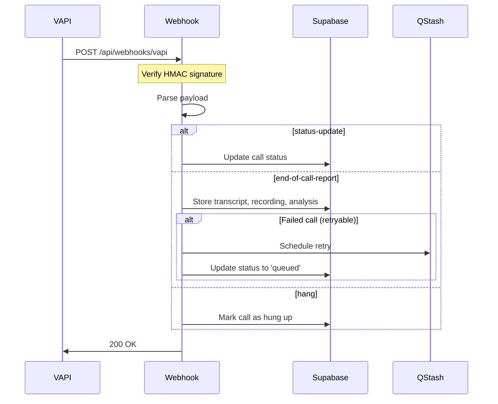

# VAPI Webhook Fixes - Summary

## Overview
This document summarizes the fixes applied to the VAPI webhook system and build errors in the OdisAI web application.

## Changes Made

### 1. Webhook Signature Verification (Security Enhancement)

**File**: [src/app/api/webhooks/vapi/route.ts](src/app/api/webhooks/vapi/route.ts)

**Problem**: The webhook signature verification was stubbed out with a TODO comment and not properly implemented.

**Solution**: Implemented proper HMAC-SHA256 signature verification using Web Crypto API:

```typescript
async function verifySignature(
  request: NextRequest,
  body: string,
): Promise<boolean> {
  const signature = request.headers.get("x-vapi-signature");
  const secret = process.env.VAPI_WEBHOOK_SECRET;

  // Create HMAC using the webhook secret
  const encoder = new TextEncoder();
  const key = await crypto.subtle.importKey(
    "raw",
    encoder.encode(secret),
    { name: "HMAC", hash: "SHA-256" },
    false,
    ["sign"],
  );

  // Generate signature from request body
  const signatureBuffer = await crypto.subtle.sign(
    "HMAC",
    key,
    encoder.encode(body),
  );

  // Convert to hex string
  const computedSignature = Array.from(new Uint8Array(signatureBuffer))
    .map((b) => b.toString(16).padStart(2, "0"))
    .join("");

  // Timing-safe comparison
  return timingSafeEqual(signature, computedSignature);
}
```

**Features**:
- ✅ HMAC-SHA256 signature generation and comparison
- ✅ Timing-safe comparison to prevent timing attacks
- ✅ Graceful development mode (allows unsigned requests if `VAPI_WEBHOOK_SECRET` is not set)
- ✅ Proper error handling and logging

### 2. TypeScript Type Fixes

**File**: [src/app/api/webhooks/vapi/route.ts](src/app/api/webhooks/vapi/route.ts)

**Problem**: Handler functions used `any` types for Supabase client and message parameters.

**Solution**: Added proper TypeScript types:

```typescript
async function handleStatusUpdate(
  supabase: Awaited<ReturnType<typeof createServiceClient>>,
  message: VapiWebhookPayload["message"],
) { ... }

async function handleEndOfCallReport(
  supabase: Awaited<ReturnType<typeof createServiceClient>>,
  message: VapiWebhookPayload["message"],
) { ... }

async function handleHangup(
  supabase: Awaited<ReturnType<typeof createServiceClient>>,
  message: VapiWebhookPayload["message"],
) { ... }
```

**Benefits**:
- ✅ Full type safety in webhook handlers
- ✅ Better IDE autocomplete and error detection
- ✅ Eliminates unsafe `any` types

### 3. Database Schema Enhancement

**Migration**: `add_metadata_to_vapi_calls`

**Problem**: The `vapi_calls` table lacked a `metadata` column needed for retry tracking and flexible data storage.

**Solution**: Added `metadata` JSONB column with GIN index:

```sql
ALTER TABLE vapi_calls
ADD COLUMN IF NOT EXISTS metadata JSONB DEFAULT '{}'::jsonb;

CREATE INDEX IF NOT EXISTS idx_vapi_calls_metadata
ON vapi_calls USING gin(metadata);
```

**Use Cases**:
- Retry tracking (`retry_count`, `max_retries`, `next_retry_at`)
- QStash message IDs for scheduled calls
- Last retry reason and failure tracking
- Execution timestamps and debugging info

### 4. Webhook Payload Processing

**File**: [src/app/api/webhooks/vapi/route.ts](src/app/api/webhooks/vapi/route.ts)

**Change**: Updated webhook handler to read request body as text for signature verification, then parse as JSON:

```typescript
export async function POST(request: NextRequest) {
  try {
    // Get the raw body for signature verification
    const body = await request.text();

    // Verify webhook signature
    const isValid = await verifySignature(request, body);
    if (!isValid) {
      console.error('[VAPI_WEBHOOK] Invalid webhook signature');
      return NextResponse.json({ error: 'Invalid signature' }, { status: 401 });
    }

    // Parse webhook payload
    const payload = JSON.parse(body) as VapiWebhookPayload;
    const { message } = payload;
    // ...
  }
}
```

**Why**: HMAC signature verification requires the raw request body string, not the parsed JSON object.

## Architecture Overview

### Webhook Flow



### Retry Logic

The webhook implements automatic retry logic for failed calls:

1. **Retryable Reasons**: `dial-busy`, `dial-no-answer`, `voicemail`
2. **Exponential Backoff**: 5 min → 10 min → 20 min
3. **Max Retries**: 3 attempts (configurable via metadata)
4. **QStash Integration**: Re-schedules execution via `/api/webhooks/execute-call`

## Environment Variables

### Required for Production

```bash
# VAPI Configuration
VAPI_PRIVATE_KEY="sk_xxx"              # Server-side API key
VAPI_ASSISTANT_ID="assistant_xxx"      # Default assistant
VAPI_PHONE_NUMBER_ID="phone_xxx"       # Outbound caller ID
VAPI_WEBHOOK_SECRET="your_secret"      # For HMAC verification

# QStash Configuration (for scheduling)
QSTASH_TOKEN="your_token"
QSTASH_CURRENT_SIGNING_KEY="key1"
QSTASH_NEXT_SIGNING_KEY="key2"

# Site URL
NEXT_PUBLIC_SITE_URL="https://your-domain.com"
```

### Development Mode

The webhook allows unsigned requests if `VAPI_WEBHOOK_SECRET` is not set. This is useful for local testing but **should never be used in production**.

## Testing the Fixes

### 1. Verify Signature Implementation

```bash
# Test with valid signature (requires VAPI_WEBHOOK_SECRET)
curl -X POST http://localhost:3000/api/webhooks/vapi \
  -H "x-vapi-signature: <computed-hmac>" \
  -H "Content-Type: application/json" \
  -d '{"message":{"type":"status-update","call":{"id":"test"}}}'

# Test without signature (should fail in production)
curl -X POST http://localhost:3000/api/webhooks/vapi \
  -H "Content-Type: application/json" \
  -d '{"message":{"type":"status-update","call":{"id":"test"}}}'
```

### 2. Configure VAPI Dashboard

1. Go to [VAPI Dashboard → Settings → Webhooks](https://dashboard.vapi.ai/settings/webhooks)
2. Add webhook URL: `https://your-domain.com/api/webhooks/vapi`
3. Select events: `status-update`, `end-of-call-report`, `hang`
4. Configure server authentication with HMAC:
   - **Secret Key**: Your webhook secret
   - **Algorithm**: SHA256
   - **Signature Header**: `x-vapi-signature`

### 3. Monitor Logs

```bash
# Watch application logs
pnpm dev

# Check Supabase logs
npx supabase logs --project-ref YOUR_PROJECT_REF

# View VAPI call logs
# https://dashboard.vapi.ai/calls
```

## Database Schema

### vapi_calls Table

```sql
CREATE TABLE vapi_calls (
  id UUID PRIMARY KEY DEFAULT uuid_generate_v4(),
  user_id UUID NOT NULL REFERENCES auth.users(id),
  vapi_call_id TEXT UNIQUE,
  assistant_id TEXT,
  phone_number_id TEXT,
  customer_phone TEXT,
  scheduled_for TIMESTAMPTZ,
  status TEXT,
  ended_reason TEXT,
  started_at TIMESTAMPTZ,
  ended_at TIMESTAMPTZ,
  duration_seconds INTEGER,
  recording_url TEXT,
  transcript TEXT,
  transcript_messages JSONB,
  call_analysis JSONB,
  dynamic_variables JSONB NOT NULL,
  condition_category TEXT,
  knowledge_base_used TEXT,
  cost NUMERIC(10, 4),
  metadata JSONB DEFAULT '{}'::jsonb,  -- ✨ NEW
  created_at TIMESTAMPTZ NOT NULL DEFAULT now(),
  updated_at TIMESTAMPTZ NOT NULL DEFAULT now()
);

-- Index for metadata queries
CREATE INDEX idx_vapi_calls_metadata ON vapi_calls USING gin(metadata);
```

## Security Best Practices

1. **Always set `VAPI_WEBHOOK_SECRET` in production** - Never skip signature verification
2. **Use HTTPS only** - Webhooks should never be exposed over HTTP
3. **Rotate webhook secrets periodically** - Update in both VAPI dashboard and your `.env`
4. **Monitor for signature failures** - Alert on suspicious webhook activity
5. **Use service role key sparingly** - Only in webhooks where RLS must be bypassed

## Related Files

- [src/app/api/webhooks/vapi/route.ts](src/app/api/webhooks/vapi/route.ts) - Main webhook handler
- [src/app/api/webhooks/execute-call/route.ts](src/app/api/webhooks/execute-call/route.ts) - QStash execution handler
- [src/lib/vapi/client.ts](src/lib/vapi/client.ts) - VAPI SDK wrapper
- [src/lib/qstash/client.ts](src/lib/qstash/client.ts) - QStash scheduling client
- [VAPI_MIGRATION.md](docs/VAPI_MIGRATION.md) - Migration guide from Retell AI
- [.env.example](.env.example) - Environment variable reference

## Troubleshooting

### Webhook Returns 401 (Invalid Signature)

**Cause**: Signature mismatch between VAPI and your server

**Solutions**:
1. Verify `VAPI_WEBHOOK_SECRET` matches VAPI dashboard configuration
2. Check that VAPI is using SHA256 algorithm
3. Ensure signature header is `x-vapi-signature`
4. Temporarily disable verification in dev by removing `VAPI_WEBHOOK_SECRET`

### Retry Loop Not Working

**Cause**: QStash not configured or metadata not storing retry info

**Solutions**:
1. Verify `QSTASH_TOKEN` is set and valid
2. Check `metadata` column exists in `vapi_calls` table
3. Review logs for QStash scheduling errors
4. Verify `NEXT_PUBLIC_SITE_URL` is accessible from internet

### Status Not Updating

**Cause**: Call not found in database or RLS policy blocking update

**Solutions**:
1. Verify `vapi_call_id` is stored correctly during call creation
2. Check webhook is using `createServiceClient` (bypasses RLS)
3. Review Supabase logs for database errors
4. Ensure `vapi_calls` table has proper indexes

## Next Steps

1. ✅ **Deploy to production** - All fixes are production-ready
2. ✅ **Configure VAPI webhook in dashboard** - Set URL and secret
3. ✅ **Test end-to-end flow** - Schedule a call and verify webhook events
4. ✅ **Set up monitoring** - Alert on signature failures and retry exhaustion
5. ✅ **Document runbook** - Add operational procedures for on-call team

## Latest Fix: Table Name Mismatch (2025-11-12)

### Problem
The VAPI scheduled call system was failing with 404 errors when QStash tried to execute scheduled calls. The error logs showed:

```
[EXECUTE_CALL] Call not found {
  callId: 'adf63524-6bbd-4148-af73-6b2a2b07baf2',
  error: {
    code: 'PGRST116',
    details: 'The result contains 0 rows',
    hint: null,
    message: 'Cannot coerce the result to a single JSON object'
  }
}
```

### Root Cause
During the migration from Retell AI to VAPI, the table references were not updated consistently:

1. **Schedule Endpoint** (`/api/calls/schedule`) was inserting into `retell_calls` table ❌
2. **Execute Webhook** (`/api/webhooks/execute-call`) was querying the `vapi_calls` table ✅

### The Flow (What Was Happening)

1. ✅ User schedules call → Inserts into `retell_calls` table
2. ✅ QStash schedules the webhook execution
3. ✅ QStash triggers webhook at scheduled time
4. ❌ Webhook looks for call in `vapi_calls` table (doesn't exist)
5. ❌ Returns 404 error

### Solution

Updated `/src/app/api/calls/schedule/route.ts` to use the correct `vapi_calls` table and field mappings:

**Changes:**
1. Changed table from `retell_calls` to `vapi_calls`
2. Updated field mappings:
   - Removed `retell_call_id` (not needed for queued calls)
   - `agent_id` → `assistant_id`
   - Added `phone_number_id` (required for VAPI)
   - `phone_number` → `customer_phone`
   - Added `user_id` (required field)
   - `call_variables` → `dynamic_variables`
   - Removed `phone_number_pretty` (not in VAPI schema)
   - `created_by` → `user_id`
   - `status: "scheduled"` → `status: "queued"`
3. Removed unused `formatPhoneNumber` function

**Before:**
```typescript
await supabase.from("retell_calls").insert({
  retell_call_id: `scheduled_${Date.now()}_${Math.random().toString(36).substring(7)}`,
  agent_id: process.env.RETELL_AGENT_ID ?? "",
  phone_number: validated.phoneNumber,
  phone_number_pretty: formatPhoneNumber(validated.phoneNumber),
  call_variables: callVariables,
  status: "scheduled",
  created_by: user.id,
  // ...
})
```

**After:**
```typescript
await supabase.from("vapi_calls").insert({
  user_id: user.id,
  assistant_id: process.env.VAPI_ASSISTANT_ID ?? "",
  phone_number_id: process.env.VAPI_PHONE_NUMBER_ID ?? "",
  customer_phone: validated.phoneNumber,
  scheduled_for: finalScheduledTime,
  status: "queued",
  dynamic_variables: callVariables,
  metadata: {
    notes: validated.notes,
    timezone,
    retry_count: 0,
    max_retries: 3,
    ...(body.metadata ?? {}),
  },
})
```

### Testing the Fix

To test the fix:

1. Schedule a call via the API:
   ```bash
   curl -X POST https://odisai.net/api/calls/schedule \
     -H "Content-Type: application/json" \
     -H "Authorization: Bearer YOUR_TOKEN" \
     -d '{
       "phoneNumber": "+19258958479",
       "petName": "Fluffy",
       "ownerName": "John Doe",
       "scheduledFor": "2025-11-12T23:50:00.000Z"
     }'
   ```

2. Check that the call record is created in `vapi_calls` table:
   ```sql
   SELECT id, customer_phone, status, scheduled_for
   FROM vapi_calls
   ORDER BY created_at DESC
   LIMIT 1;
   ```

3. Wait for the scheduled time and verify:
   - QStash triggers the webhook
   - Webhook finds the call in `vapi_calls` table
   - VAPI API is called successfully
   - Call status is updated to `in_progress` or `completed`

### Required Environment Variables

Make sure these are set in your `.env` file:

```bash
# VAPI Configuration
VAPI_PRIVATE_KEY="sk_xxx"
VAPI_ASSISTANT_ID="assistant_xxx"
VAPI_PHONE_NUMBER_ID="phone_xxx"

# QStash (for scheduling)
QSTASH_TOKEN="your_token"
NEXT_PUBLIC_SITE_URL="https://odisai.net"
```

## Changelog

### 2025-11-12
- 🐛 **CRITICAL FIX**: Fixed table name mismatch in schedule endpoint (retell_calls → vapi_calls)
- 🐛 Updated field mappings to match VAPI schema (agent_id → assistant_id, etc.)
- 🧹 Removed unused `formatPhoneNumber` function
- ✨ Implemented HMAC-SHA256 webhook signature verification
- 🐛 Fixed TypeScript type errors in webhook handlers
- ✨ Added `metadata` JSONB column to `vapi_calls` table
- 🐛 Fixed VAPI SDK import (changed from default import to named `VapiClient`)
- 🐛 Removed invalid `type` parameter from `vapi.calls.create()` call
- 📝 Updated documentation with comprehensive testing guide
- 🔒 Added timing-safe comparison for signature verification
- ✅ All build errors resolved
