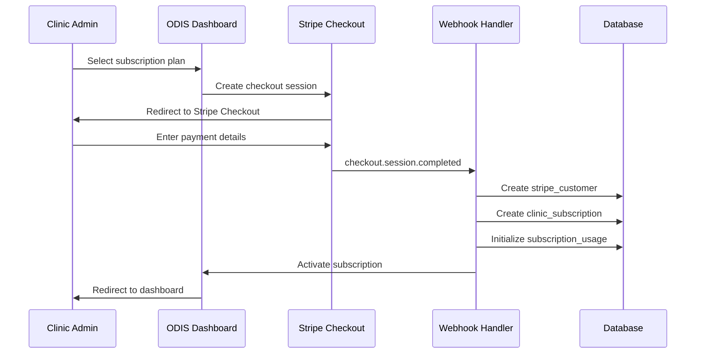
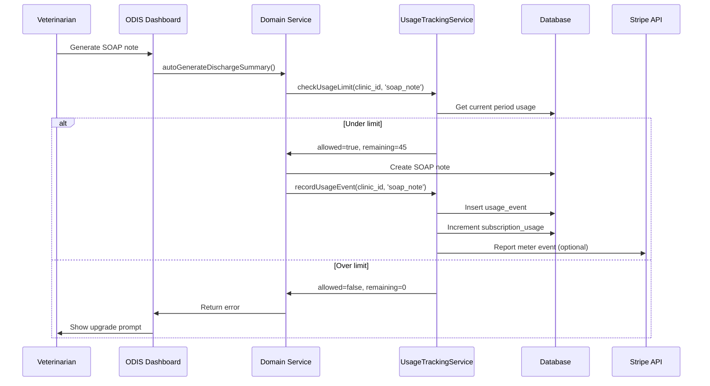

# Stripe Subscription Billing with Usage Tracking

Product Requirements Document

Version 1.0 | January 14, 2026

| Field            | Value                     |
| ---------------- | ------------------------- |
| Document Version | 1.0                       |
| Date             | January 14, 2026          |
| Author           | Engineering Team          |
| Status           | Draft - Awaiting Approval |
| Related Tickets  | TBD                       |

---

## 1. Executive Summary

### 1.1 Purpose

This PRD defines the implementation of Stripe-based subscription billing for ODIS AI, enabling recurring revenue through tiered subscription plans with usage-based limits. The system will support free trials, multiple pricing tiers, and comprehensive usage tracking for outbound/inbound calls, SOAP notes, discharge summaries, and case ingestions.

### 1.2 Scope

**In Scope:**

- Stripe Customer Portal integration
- Tiered subscription plans (Free Trial, Starter, Professional, Enterprise)
- Usage tracking for billable actions (calls, SOAP notes, discharge summaries, case ingestions)
- Subscription limit enforcement (hard/soft limits)
- Stripe Checkout for subscription signup
- Webhook handling for payment events
- Billing analytics dashboard for clinics
- Admin tools for plan management
- Automated usage reporting to Stripe
- Payment history tracking

**Out of Scope (Future Phases):**

- Metered billing/overage charges (Phase 2)
- Annual prepayment discounts (Phase 2)
- Custom enterprise pricing (Phase 3)
- Invoice customization (Phase 3)
- Multi-currency support (Phase 3)
- Affiliate/referral program (Phase 4)

### 1.3 Key Outcomes

- **Recurring Revenue**: Predictable monthly revenue from subscription plans
- **Usage Visibility**: Clinics see real-time usage against their plan limits
- **Self-Service**: Clinics can upgrade/downgrade without manual intervention
- **Automated Billing**: Zero-touch payment collection via Stripe
- **Fair Access**: Free trial allows clinics to test before committing
- **Scalable Pricing**: Tiers support clinics from small to enterprise

---

## 2. Problem Statement

### 2.1 Current State

**Revenue Model:**

- No subscription billing - all features available to all users
- No usage tracking or limits
- No mechanism to monetize platform usage
- Unclear unit economics per clinic

**Challenges:**

1. **Unsustainable Growth**: Every new clinic increases costs (VAPI, infrastructure) without revenue
2. **No Usage Controls**: No way to prevent abuse or excessive API calls
3. **Unclear Value Tiers**: All users get same features regardless of needs
4. **Manual Onboarding**: No self-service signup flow

### 2.2 Target State

**Subscription-Based Revenue:**

```
graph LR
A[Clinic Signs Up] -->|Stripe Checkout| B[Free Trial 14 Days]
B -->|Trial Ends| C[Subscription Required]
C -->|Selects Plan| D[Stripe Payment]
D -->|Success| E[Active Subscription]
E -->|Monthly Billing| F[Recurring Revenue]
E -->|Usage Tracking| G[Analytics Dashboard]
G -->|Near Limit| H[Upgrade Prompt]
```

**Value Creation:**

- Clinics pay for value received (calls, SOAP notes, automation)
- Platform scales profitably with customer growth
- Usage limits prevent runaway costs
- Self-service reduces sales/support overhead

### 2.3 Market Validation

**Competitive Analysis:**

- **Weave**: $349/mo base + per-call fees
- **Solutionreach**: $299/mo + usage-based pricing
- **Vetspire**: $295/mo + implementation fees
- **ODIS AI Positioning**: $99-$599/mo all-inclusive pricing

**Target Customer Segments:**

1. **Small Clinics (1-3 vets)**: 50-100 calls/mo → Starter ($99)
2. **Mid-size Clinics (4-8 vets)**: 150-250 calls/mo → Professional ($299)
3. **Large/Multi-location (9+ vets)**: 300+ calls/mo → Enterprise ($599)

---

## 3. Solution Architecture

### 3.1 High-Level Architecture

```
┌─────────────────────────────────────────────────────────┐
│                    User Layer                           │
│    Clinic Dashboard | Billing Portal | Admin Panel      │
└────────────────────┬────────────────────────────────────┘
                     │
┌────────────────────▼────────────────────────────────────┐
│                  API & Security Layer                    │
│    tRPC Routers | Server Actions | Stripe Webhooks      │
└────────────────────┬────────────────────────────────────┘
                     │
┌────────────────────▼────────────────────────────────────┐
│               Data Persistence Layer                     │
│                Supabase PostgreSQL                       │
│  ┌──────────────────────────────────────────────────┐  │
│  │ stripe_customers      | subscription_plans       │  │
│  │ clinic_subscriptions  | subscription_usage       │  │
│  │ usage_events          | payment_history          │  │
│  └──────────────────────────────────────────────────┘  │
└────────────────────┬────────────────────────────────────┘
                     │
┌────────────────────▼────────────────────────────────────┐
│              Domain Services Layer                       │
│   SubscriptionService | UsageTrackingService |          │
│   PlanEnforcementService | BillingAnalyticsService      │
└────────────────────┬────────────────────────────────────┘
                     │
┌────────────────────▼────────────────────────────────────┐
│               External Services                          │
│     Stripe API | Stripe Webhooks | Stripe Checkout      │
└─────────────────────────────────────────────────────────┘
```

### 3.2 Data Flow Sequence

**Subscription Signup Flow:**



**Usage Tracking Flow:**



---

## 4. User Personas & Workflows

### 4.1 Persona A: Small Clinic Owner (Free Trial → Starter)

**Representative:** Dr. Sarah Johnson, solo practitioner

**Current Pain Points:**

- Unsure if AI calls will work for her practice
- Budget-conscious, wants to test before paying
- Needs basic discharge calls only

**Workflow:**

1. **Sign up for free trial** (14 days, 10 outbound calls, 5 inbound)
2. Test with 5-8 discharge calls
3. Review call quality and client feedback
4. Trial ending notification → Prompted to subscribe
5. Selects **Starter Plan** ($99/mo, 50 calls/mo)
6. Enters payment via Stripe Checkout
7. Subscription activated, usage resets
8. Monthly billing on autopilot

**Success Metrics:**

- Completes 5+ calls during trial (engagement)
- Converts to paid within 14 days (conversion)
- Stays subscribed >3 months (retention)

### 4.2 Persona B: Multi-Doctor Practice (Professional Plan)

**Representative:** Happy Paws Veterinary (5 doctors, 2 locations)

**Current Pain Points:**

- High volume of discharge calls (150-200/month)
- Need IDEXX sync for efficiency
- Want usage analytics for cost management

**Workflow:**

1. Sign up directly for **Professional Plan** ($299/mo)
2. Configure IDEXX sync integration
3. Generate 150-180 discharge calls/month
4. Use unlimited SOAP notes feature
5. Review usage dashboard weekly
6. Receive "80% usage" alert mid-month
7. Continue at current plan (within limits)
8. Renews automatically next month

**Success Metrics:**

- Uses 150-200 calls/mo consistently (product fit)
- IDEXX sync active (integration adoption)
- Stays within plan limits (appropriate tier)

### 4.3 Persona C: Enterprise Veterinary Group (Enterprise Plan)

**Representative:** VetCare Network (12 locations, 40 vets)

**Current Pain Points:**

- Massive call volume (500+ calls/month)
- Need custom branding and priority support
- Want API access for custom integrations

**Workflow:**

1. Contact sales for **Enterprise Plan** ($599/mo)
2. Negotiate unlimited calls + custom features
3. Onboarding with dedicated support
4. Deploy across all 12 locations
5. Track usage per location via analytics
6. Monthly review call with customer success
7. Annual contract renewal with volume discount

**Success Metrics:**

- 500+ calls/mo across locations (volume)
- Custom branding deployed (enterprise features)
- Annual renewal (long-term commitment)

### 4.4 Workflow Comparison Matrix

| Aspect         | Free Trial    | Starter         | Professional    | Enterprise       |
| -------------- | ------------- | --------------- | --------------- | ---------------- |
| Signup Flow    | Self-service  | Self-service    | Self-service    | Sales-assisted   |
| Onboarding     | Automated     | Automated       | Automated       | White-glove      |
| Payment Method | No payment    | Stripe Checkout | Stripe Checkout | Invoice/Contract |
| Usage Limits   | 10 calls      | 50 calls        | 200 calls       | Unlimited        |
| Support        | Email only    | Email           | Priority email  | Dedicated Slack  |
| IDEXX Sync     | No            | No              | Yes             | Yes + custom     |
| Analytics      | Basic         | Standard        | Advanced        | Custom reports   |
| Billing Cycle  | 14 days trial | Monthly         | Monthly/Annual  | Annual contract  |

---

## 5. Detailed Requirements

### 5.1 Functional Requirements

**FR-1: Subscription Plans Management**

| ID     | Requirement                                            | Priority |
| ------ | ------------------------------------------------------ | -------- |
| FR-1.1 | Create 4 subscription plans (Trial, Starter, Pro, Ent) | P0       |
| FR-1.2 | Store plan metadata in subscription_plans table        | P0       |
| FR-1.3 | Sync plans with Stripe Products/Prices                 | P0       |
| FR-1.4 | Support monthly billing cycles                         | P0       |
| FR-1.5 | Free trial plan with 14-day duration                   | P0       |
| FR-1.6 | Admin UI to create/edit plans                          | P1       |
| FR-1.7 | Display plan features in pricing page                  | P0       |
| FR-1.8 | Support plan upgrades/downgrades                       | P1       |

**FR-2: Subscription Lifecycle**

| ID     | Requirement                                            | Priority |
| ------ | ------------------------------------------------------ | -------- |
| FR-2.1 | Create Stripe customer on clinic signup                | P0       |
| FR-2.2 | Redirect to Stripe Checkout for payment                | P0       |
| FR-2.3 | Store subscription in clinic_subscriptions table       | P0       |
| FR-2.4 | Track subscription status (trialing, active, past_due) | P0       |
| FR-2.5 | Handle subscription cancellations                      | P0       |
| FR-2.6 | Support subscription pauses                            | P1       |
| FR-2.7 | Automatic trial-to-paid conversion                     | P0       |
| FR-2.8 | Subscription renewal reminders                         | P1       |

**FR-3: Usage Tracking**

| ID     | Requirement                                           | Priority |
| ------ | ----------------------------------------------------- | -------- |
| FR-3.1 | Track outbound call usage per billing period          | P0       |
| FR-3.2 | Track inbound call usage per billing period           | P0       |
| FR-3.3 | Track SOAP note generation per billing period         | P0       |
| FR-3.4 | Track discharge summary generation per billing period | P0       |
| FR-3.5 | Track case ingestions per billing period              | P0       |
| FR-3.6 | Store detailed usage events for audit trail           | P0       |
| FR-3.7 | Aggregate usage in subscription_usage table           | P0       |
| FR-3.8 | Reset usage counters at period start                  | P0       |
| FR-3.9 | Track VAPI call costs per billing period              | P1       |

**FR-4: Limit Enforcement**

| ID     | Requirement                                   | Priority |
| ------ | --------------------------------------------- | -------- |
| FR-4.1 | Check usage limits before allowing actions    | P0       |
| FR-4.2 | Block actions when limit reached (hard limit) | P0       |
| FR-4.3 | Display remaining usage to users              | P0       |
| FR-4.4 | Show upgrade prompt when limit reached        | P0       |
| FR-4.5 | Allow unlimited usage for Enterprise tier     | P0       |
| FR-4.6 | Grace period for payment failures (3 days)    | P1       |
| FR-4.7 | Admin override to bypass limits               | P1       |

**FR-5: Billing Dashboard**

| ID     | Requirement                                    | Priority |
| ------ | ---------------------------------------------- | -------- |
| FR-5.1 | Display current subscription plan and status   | P0       |
| FR-5.2 | Show usage against plan limits (progress bars) | P0       |
| FR-5.3 | Display billing period dates                   | P0       |
| FR-5.4 | Show payment history with invoice links        | P0       |
| FR-5.5 | Provide upgrade/downgrade options              | P1       |
| FR-5.6 | Link to Stripe Customer Portal                 | P0       |
| FR-5.7 | Display next billing date and amount           | P0       |
| FR-5.8 | Show trial days remaining (if in trial)        | P0       |

**FR-6: Stripe Webhooks**

| ID     | Requirement                                 | Priority |
| ------ | ------------------------------------------- | -------- |
| FR-6.1 | Handle checkout.session.completed           | P0       |
| FR-6.2 | Handle customer.subscription.created        | P0       |
| FR-6.3 | Handle customer.subscription.updated        | P0       |
| FR-6.4 | Handle customer.subscription.deleted        | P0       |
| FR-6.5 | Handle invoice.paid                         | P0       |
| FR-6.6 | Handle invoice.payment_failed               | P0       |
| FR-6.7 | Handle customer.subscription.trial_will_end | P1       |
| FR-6.8 | Verify webhook signatures                   | P0       |
| FR-6.9 | Log all webhook events for audit            | P0       |

### 5.2 Non-Functional Requirements

| ID    | Requirement                     | Target                 | Category    |
| ----- | ------------------------------- | ---------------------- | ----------- |
| NFR-1 | Usage limit check latency       | <100ms                 | Performance |
| NFR-2 | Stripe webhook processing time  | <3 seconds             | Performance |
| NFR-3 | Subscription data availability  | 99.9% uptime           | Reliability |
| NFR-4 | Payment data encryption         | PCI DSS compliant      | Security    |
| NFR-5 | Usage event retention           | 2 years minimum        | Compliance  |
| NFR-6 | Concurrent subscription updates | 100+ clinics           | Scalability |
| NFR-7 | Webhook retry tolerance         | 3 retries with backoff | Resilience  |

---

## 6. Subscription Plans

### 6.1 Pricing Tiers

| Feature                     | Free Trial   | Starter  | Professional | Enterprise |
| --------------------------- | ------------ | -------- | ------------ | ---------- |
| **Price**                   | $0 (14 days) | $99/mo   | $299/mo      | $599/mo    |
| **Outbound Calls**          | 10           | 50       | 200          | Unlimited  |
| **Inbound Calls**           | 5            | 25       | 100          | Unlimited  |
| **SOAP Notes**              | 10           | 100      | Unlimited    | Unlimited  |
| **Discharge Summaries**     | 10           | 100      | Unlimited    | Unlimited  |
| **Case Ingestions**         | 20           | 200      | Unlimited    | Unlimited  |
| **IDEXX Sync**              | ❌           | ❌       | ✅           | ✅         |
| **Analytics Dashboard**     | Basic        | Standard | Advanced     | Custom     |
| **Email Support**           | ✅           | ✅       | ✅           | ✅         |
| **Priority Support**        | ❌           | ❌       | ✅           | ✅         |
| **Dedicated Slack Channel** | ❌           | ❌       | ❌           | ✅         |
| **Custom Branding**         | ❌           | ❌       | ❌           | ✅         |
| **API Access**              | ❌           | ❌       | ❌           | ✅         |
| **Multi-location Support**  | ❌           | ❌       | ✅           | ✅         |

### 6.2 Plan Selection Logic

**Recommended Tier:**

```
if (avg_monthly_calls <= 50) → Starter
else if (avg_monthly_calls <= 200) → Professional
else → Enterprise
```

**Upgrade Triggers:**

- 80% of limit reached → Show upgrade notification
- 100% of limit reached → Block action, require upgrade
- 3 months of consistent high usage → Proactive upgrade suggestion

---

## 7. User Experience

### 7.1 Subscription Signup Flow

**Step 1: Plan Selection Page** (`/pricing`)

- Display all 4 plans in card layout
- Highlight "most popular" (Professional)
- Show feature comparison table
- "Start Free Trial" CTA for Free Trial
- "Subscribe Now" CTA for paid plans

**Step 2: Stripe Checkout**

- Redirect to Stripe-hosted checkout page
- Customer enters payment details (credit card)
- Stripe handles PCI compliance
- Success → Redirect to `/dashboard?subscribed=true`
- Cancel → Redirect to `/pricing?canceled=true`

**Step 3: Post-Signup**

- Show welcome modal with subscription details
- Display "Trial Active" or "Subscription Active" badge
- Redirect to quick start guide

### 7.2 Usage Dashboard

**Location:** `/dashboard/billing`

**Layout:**

```
┌─────────────────────────────────────────────────────────┐
│  Subscription Overview                                  │
│  ┌─────────────────────────────────────────────────┐   │
│  │  Professional Plan             $299/mo          │   │
│  │  Status: Active                                 │   │
│  │  Next billing: Feb 14, 2026                     │   │
│  │  [Manage Subscription] [View Invoices]          │   │
│  └─────────────────────────────────────────────────┘   │
│                                                         │
│  Current Usage (Jan 14 - Feb 14, 2026)                 │
│  ┌─────────────────────────────────────────────────┐   │
│  │  Outbound Calls     ████████░░  145 / 200       │   │
│  │  Inbound Calls      ███░░░░░░░   62 / 100       │   │
│  │  SOAP Notes         Unlimited                   │   │
│  │  Discharge Summaries Unlimited                  │   │
│  └─────────────────────────────────────────────────┘   │
│                                                         │
│  Payment History                                       │
│  ┌─────────────────────────────────────────────────┐   │
│  │  Jan 14, 2026   $299.00  Paid   [View Invoice] │   │
│  │  Dec 14, 2025   $299.00  Paid   [View Invoice] │   │
│  │  Nov 14, 2025   $299.00  Paid   [View Invoice] │   │
│  └─────────────────────────────────────────────────┘   │
└─────────────────────────────────────────────────────────┘
```

### 7.3 Limit Warning Flow

**80% Usage Warning:**

- Show yellow badge in nav: "80% usage"
- Banner at top of dashboard
- Email notification to admin
- Message: "You've used 80% of your outbound calls. Consider upgrading to avoid interruptions."

**100% Limit Reached:**

- Block action (e.g., can't schedule discharge call)
- Show modal: "Limit Reached - Upgrade to Continue"
- Options: [Upgrade Now] [Contact Sales] [Cancel]
- Log event to analytics

---

## 8. Analytics & Reporting

### 8.1 Admin Metrics

**Revenue Metrics:**

- Monthly Recurring Revenue (MRR)
- Annual Recurring Revenue (ARR)
- Average Revenue Per User (ARPU)
- Customer Lifetime Value (LTV)
- Churn Rate (monthly)

**Subscription Metrics:**

- Total active subscriptions
- Subscriptions by plan tier
- Trial-to-paid conversion rate
- Upgrade rate (Starter → Pro)
- Downgrade rate (Pro → Starter)
- Cancellation rate

**Usage Metrics:**

- Average usage per plan tier
- Percentage of clinics at 80%+ usage
- Percentage of clinics under 50% usage (under-utilizing)
- Cost per action (VAPI costs / total calls)

### 8.2 Clinic Analytics

**Clinic Dashboard Metrics:**

- Total actions this period
- Cost per action (if metered)
- Comparison to previous period
- Usage trends (line chart)
- Projected usage at current rate

---

## 9. Success Metrics

### 9.1 Primary KPIs

| Metric                   | Target | Measurement                          |
| ------------------------ | ------ | ------------------------------------ |
| Trial-to-Paid Conversion | >40%   | paid_subscriptions / trials_started  |
| Monthly Churn Rate       | <5%    | cancellations / active_subscriptions |
| Upgrade Rate             | >20%   | upgrades / total_subscriptions       |
| Payment Success Rate     | >95%   | successful_payments / total_attempts |
| Free Trial Activation    | >60%   | trials_with_usage / trials_created   |

### 9.2 Operational Metrics

- Mean Time to First Payment: <24 hours from signup
- Subscription Activation Time: <5 seconds post-payment
- Webhook Processing Success: >99.9%
- Billing Dashboard Load Time: <2 seconds

### 9.3 Business Outcomes

- **Revenue Growth**: 10% MoM increase in MRR
- **Customer Acquisition Cost (CAC)**: <$500 per clinic
- **CAC Payback Period**: <6 months
- **Customer Retention**: 85% annual retention rate

---

## 10. Risk Analysis

### 10.1 Risk Matrix

| Risk                       | Probability | Impact | Mitigation Strategy                                     |
| -------------------------- | ----------- | ------ | ------------------------------------------------------- |
| Stripe API Changes         | Low         | High   | Pin SDK version, monitor changelog, comprehensive tests |
| Payment Failure Handling   | Medium      | High   | Grace period, dunning emails, Stripe Smart Retries      |
| Usage Tracking Drift       | Medium      | Medium | Idempotent event logging, reconciliation jobs           |
| Subscription Cancellations | High        | Medium | Exit surveys, retention offers, cancellation flow UX    |
| Pricing Misalignment       | Medium      | High   | Market research, A/B testing, customer feedback         |
| Webhook Delivery Failures  | Low         | High   | Stripe automatic retries, manual reconciliation tools   |

### 10.2 Mitigation Details

**Stripe API Version Management:**

```typescript
// Pin to specific API version
const stripe = new Stripe(process.env.STRIPE_SECRET_KEY, {
  apiVersion: "2024-12-18.acacia", // Pin version
});

// Monitor Stripe changelog
// Set up alerts for API deprecations
```

**Payment Retry Logic:**

```typescript
// Stripe Smart Retries enabled by default
// Custom dunning emails:
- Day 1: Payment failed notification
- Day 3: Retry reminder
- Day 7: Final notice before suspension
- Day 10: Subscription suspended
```

---

## 11. Future Enhancements

### 11.1 Phase 2: Metered Billing (Q2 2026)

- Overage charges for exceeding plan limits
- Pay-as-you-go pricing option
- Usage-based pricing for specific features
- Stripe Billing Meters integration

### 11.2 Phase 3: Advanced Plans (Q3 2026)

- Annual prepayment with 20% discount
- Custom enterprise pricing
- Multi-currency support (CAD, EUR, GBP)
- Invoice billing for enterprise

### 11.3 Phase 4: Monetization Expansion (Q4 2026)

- Add-on marketplace (premium SOAP templates, advanced analytics)
- Affiliate/referral program
- White-label reseller program
- Partner integrations (Cornerstone, ezyVet)

---

## 12. Open Questions

### 12.1 Product Questions

1. **Overage handling**: Block actions or allow with overage charges?
   - **Recommendation**: Block with upgrade prompt (simpler UX, prevents surprise charges)

2. **Proration**: When upgrading mid-cycle, prorate immediately or at next billing?
   - **Recommendation**: Immediate proration (standard Stripe behavior)

3. **Grace period**: How long to allow access after payment fails?
   - **Recommendation**: 3 days grace period, then suspend subscription

4. **Grandfathering**: Existing clinics get free tier or require subscription?
   - **Recommendation**: 30-day notice, then migrate to Starter plan

5. **Annual pricing**: Offer discount for annual prepayment?
   - **Recommendation**: Phase 2 feature (20% discount for annual)

### 12.2 Technical Questions

1. **Usage tracking precision**: Track every action or batch by hour/day?
   - **Recommendation**: Track every action for accuracy, aggregate for display

2. **Limit enforcement**: Check limits synchronously or asynchronously?
   - **Recommendation**: Synchronous check before action (prevent race conditions)

3. **Webhook retries**: How many retries for failed webhooks?
   - **Recommendation**: Stripe's built-in retry logic (72 hours)

---

## 13. Approval & Sign-off

| Role             | Name | Date | Signature |
| ---------------- | ---- | ---- | --------- |
| Product Owner    |      |      |           |
| Engineering Lead |      |      |           |
| Finance Lead     |      |      |           |
| Customer Success |      |      |           |

---

**End of Document**

This PRD defines the complete Stripe subscription billing system for ODIS AI, enabling predictable recurring revenue while providing fair, transparent usage-based pricing for veterinary clinics.
