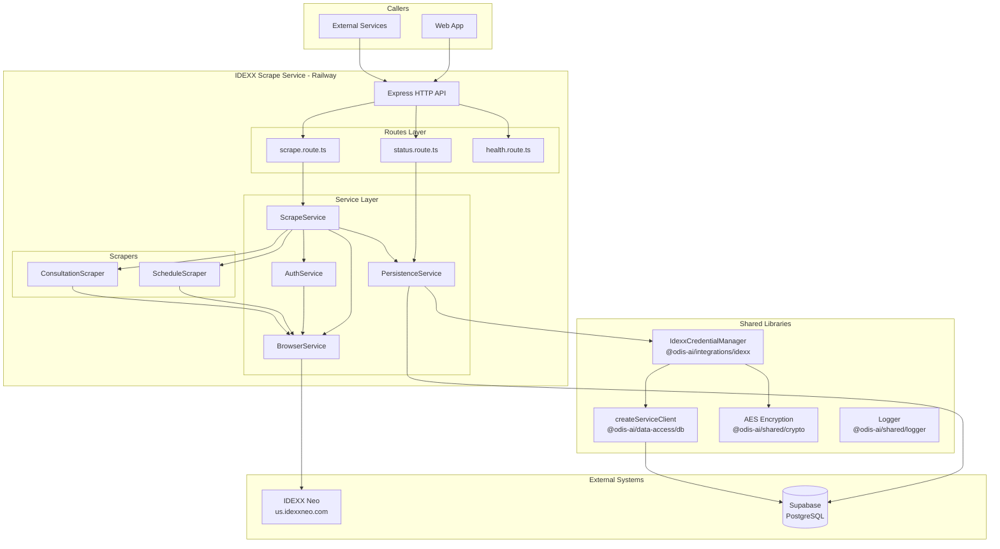

# IDEXX Scrape Service

> On-demand IDEXX Neo data scraping service using Playwright browser automation.

**Version**: 2.0.0  
**Location**: `apps/idexx-sync/`  
**Deployment**: Railway (Docker container)

---

## Table of Contents

1. [Overview](#overview)
2. [Quick Start](#quick-start)
3. [Architecture](#architecture)
4. [API Reference](#api-reference)
5. [Configuration](#configuration)
6. [Service Layer](#service-layer)
7. [Scrapers](#scrapers)
8. [Selectors](#selectors)
9. [Types Reference](#types-reference)
10. [Database Schema](#database-schema)
11. [Credential Management](#credential-management)
12. [Deployment](#deployment)
13. [Development](#development)
14. [Use Cases](#use-cases)
15. [Troubleshooting](#troubleshooting)
16. [Limitations](#limitations)

---

## Overview

`idexx-sync` is a standalone Node.js microservice for on-demand scraping of veterinary appointment schedules and consultation data from **IDEXX Neo** (a Practice Information Management System or PIMS) into Supabase. It uses Playwright browser automation and is deployed as a Docker container on Railway.

### Key Capabilities

| Feature                          | Description                                                |
| -------------------------------- | ---------------------------------------------------------- |
| **Schedule Scraping**            | Fetches appointment schedules for change detection         |
| **Consultation Scraping**        | Pulls clinical data (notes, vitals, diagnoses) when needed |
| **Single-Clinic Focus**          | Scrapes one clinic per request for targeted updates        |
| **Flexible Date Support**        | Scrape data for any date (defaults to today)               |
| **Secure Credential Management** | AES-256-GCM encrypted credentials                          |
| **Structured Logging**           | Consistent logging via `@odis-ai/shared/logger`            |
| **Modular Architecture**         | Clean separation of concerns with DI pattern               |

### Technology Stack

- **Runtime**: Node.js 20+
- **Framework**: Express.js
- **Browser Automation**: Playwright (Chromium)
- **Database**: Supabase (PostgreSQL)
- **Validation**: Zod
- **Logging**: `@odis-ai/shared/logger`
- **Encryption**: `@odis-ai/shared/crypto` (AES-256-GCM)

---

## Quick Start

### Prerequisites

1. Node.js 20+
2. pnpm
3. Supabase project with IDEXX tables
4. IDEXX credentials stored for at least one clinic

### Build and Run

```bash
# Build the application
nx build idexx-sync

# Run in headless mode (production)
pnpm --filter idexx-sync start

# Run with visible browser (debugging)
pnpm --filter idexx-sync start:visible
```

### Make a Scrape Request

```bash
# Schedule scrape for today
curl -X POST http://localhost:5050/api/idexx/scrape \
  -H "Content-Type: application/json" \
  -d '{
    "type": "schedule",
    "clinicId": "your-clinic-uuid"
  }'

# Consultation scrape for specific date
curl -X POST http://localhost:5050/api/idexx/scrape \
  -H "Content-Type: application/json" \
  -d '{
    "type": "consultation",
    "clinicId": "your-clinic-uuid",
    "date": "2025-12-27"
  }'
```

---

## Architecture

### System Diagram



### Source Code Structure

```
apps/idexx-sync/
├── src/
│   ├── main.ts                         # Express server entry point
│   │
│   ├── config/                         # Configuration layer
│   │   ├── index.ts                    # Zod env validation + config export
│   │   └── constants.ts                # URLs, timeouts, service metadata
│   │
│   ├── types/                          # Type definitions
│   │   └── index.ts                    # All TypeScript interfaces
│   │
│   ├── lib/                            # Shared utilities
│   │   └── logger.ts                   # Structured logging setup
│   │
│   ├── routes/                         # HTTP endpoints
│   │   ├── index.ts                    # Route aggregator (setupRoutes)
│   │   ├── scrape.route.ts             # POST /api/idexx/scrape
│   │   ├── status.route.ts             # GET /api/idexx/status
│   │   └── health.route.ts             # GET /health, /ready
│   │
│   ├── services/                       # Business logic
│   │   ├── index.ts                    # Service exports
│   │   ├── scrape.service.ts           # Main orchestration
│   │   ├── auth.service.ts             # IDEXX login handling
│   │   ├── browser.service.ts          # Playwright wrapper
│   │   └── persistence.service.ts      # Database operations
│   │
│   ├── scrapers/                       # Page-specific scraping
│   │   ├── index.ts                    # Scraper exports
│   │   ├── schedule.scraper.ts         # Schedule page scraping
│   │   └── consultation.scraper.ts     # Consultation page scraping
│   │
│   ├── selectors/                      # DOM selectors
│   │   ├── index.ts                    # Aggregated exports + helpers
│   │   ├── login.selectors.ts          # Login page selectors
│   │   ├── dashboard.selectors.ts      # Dashboard navigation
│   │   ├── schedule.selectors.ts       # Schedule page elements
│   │   ├── consultation.selectors.ts   # Consultation page elements
│   │   └── session.selectors.ts        # Session expiry detection
│   │
│   └── utils/                          # Utilities
│       └── phone.ts                    # Phone normalization
│
├── Dockerfile                          # Playwright-based Docker image
├── package.json                        # Dependencies
└── project.json                        # Nx build configuration
```

### Design Principles

1. **Separation of Concerns**: Each service has a single responsibility
2. **Dependency Injection**: Services accept collaborators for testability
3. **Config-First**: Environment validation at startup via Zod
4. **Structured Logging**: Consistent namespaced logging throughout
5. **Multi-Fallback Selectors**: Resilience against IDEXX UI changes
6. **Error Accumulation**: Collect all errors rather than fail-fast

---

## API Reference

### POST /api/idexx/scrape

On-demand scraping endpoint for IDEXX Neo data.

#### Request

```http
POST /api/idexx/scrape
Content-Type: application/json

{
  "type": "schedule",
  "clinicId": "550e8400-e29b-41d4-a716-446655440000",
  "date": "2025-12-27"
}
```

| Field      | Type                           | Required | Description                                     |
| ---------- | ------------------------------ | -------- | ----------------------------------------------- |
| `type`     | `"schedule" \| "consultation"` | ✅ Yes   | Type of data to scrape                          |
| `clinicId` | `string`                       | ✅ Yes   | UUID of the clinic to scrape                    |
| `date`     | `string`                       | ❌ No    | Date in `YYYY-MM-DD` format (defaults to today) |

#### Response (Success)

```json
{
  "success": true,
  "sessionId": "123e4567-e89b-12d3-a456-426614174000",
  "scrapeType": "schedule",
  "recordsScraped": 15,
  "errors": [],
  "durationMs": 45000,
  "timestamp": "2025-12-27T14:30:00.000Z"
}
```

#### Response (Error)

```json
{
  "success": false,
  "scrapeType": "schedule",
  "recordsScraped": 0,
  "errors": ["Login failed for clinic: Example Vet"],
  "durationMs": 12000,
  "timestamp": "2025-12-27T14:30:00.000Z"
}
```

| Field            | Type       | Description                                      |
| ---------------- | ---------- | ------------------------------------------------ |
| `success`        | `boolean`  | Whether the scrape completed without errors      |
| `sessionId`      | `string?`  | UUID of the scrape session (for tracking)        |
| `scrapeType`     | `string`   | Echo of the requested scrape type                |
| `recordsScraped` | `number`   | Count of records successfully processed          |
| `errors`         | `string[]` | Array of error messages (may be partial success) |
| `durationMs`     | `number`   | Total operation duration in milliseconds         |
| `timestamp`      | `string`   | ISO 8601 timestamp of response                   |

#### HTTP Status Codes

| Code  | Meaning                                                          |
| ----- | ---------------------------------------------------------------- |
| `200` | Scrape completed successfully                                    |
| `400` | Invalid request (missing/invalid type, clinicId, or date format) |
| `500` | Scrape failed (login error, scraping error, etc.)                |

---

### GET /api/idexx/status

Returns the status of the most recent scrape operation.

#### Response

```json
{
  "last_scrape": {
    "type": "appointment_sync",
    "status": "completed",
    "timestamp": "2025-12-27T14:30:00.000Z",
    "records_scraped": 15,
    "errors": []
  },
  "system_status": "healthy",
  "uptime_seconds": 3600
}
```

| Field            | Type                                 | Description                    |
| ---------------- | ------------------------------------ | ------------------------------ |
| `last_scrape`    | `object \| null`                     | Details of last scrape session |
| `system_status`  | `"healthy" \| "degraded" \| "error"` | Overall system health          |
| `uptime_seconds` | `number`                             | Service uptime in seconds      |

---

### GET /health

Railway health check endpoint.

#### Response

```json
{
  "status": "healthy",
  "service": "idexx-scrape",
  "version": "2.0.0",
  "timestamp": "2025-12-27T14:30:00.000Z",
  "uptime_seconds": 3600,
  "checks": [
    { "name": "process", "status": "pass", "message": "Process is running" },
    { "name": "memory", "status": "pass", "message": "Heap: 150MB / 512MB" },
    {
      "name": "environment",
      "status": "pass",
      "message": "All required environment variables set"
    }
  ]
}
```

---

### GET /ready

Readiness probe for Kubernetes/Railway.

#### Response (Ready)

```json
{
  "ready": true,
  "timestamp": "2025-12-27T14:30:00.000Z"
}
```

#### Response (Not Ready)

```json
{
  "ready": false,
  "message": "Missing required environment variables",
  "timestamp": "2025-12-27T14:30:00.000Z"
}
```

---

### GET /

Service information endpoint.

#### Response

```json
{
  "service": "idexx-scrape",
  "version": "2.0.0",
  "description": "IDEXX Neo On-Demand Scraping Service",
  "endpoints": {
    "scrape": {
      "method": "POST",
      "path": "/api/idexx/scrape",
      "body": {
        "type": "schedule | consultation",
        "clinicId": "uuid (required)",
        "date": "YYYY-MM-DD (optional, defaults to today)"
      }
    },
    "status": "GET /api/idexx/status",
    "health": "GET /health",
    "ready": "GET /ready"
  }
}
```

---

## Configuration

### Environment Variables

| Variable                    | Required | Default       | Description                                       |
| --------------------------- | -------- | ------------- | ------------------------------------------------- |
| `SUPABASE_URL`              | ✅ Yes   | -             | Supabase project URL                              |
| `SUPABASE_SERVICE_ROLE_KEY` | ✅ Yes   | -             | Service role key (bypasses RLS)                   |
| `ENCRYPTION_KEY`            | ✅ Yes   | -             | AES-256 encryption key (32+ chars)                |
| `PORT`                      | ❌ No    | `3001`        | Server port                                       |
| `HOST`                      | ❌ No    | `0.0.0.0`     | Server host                                       |
| `NODE_ENV`                  | ❌ No    | `development` | Environment (`development`, `production`, `test`) |
| `HEADLESS`                  | ❌ No    | `true`        | Set to `false` for visible browser debugging      |

### Config Layer (`config/index.ts`)

Environment variables are validated at startup using Zod:

```typescript
const envSchema = z.object({
  NODE_ENV: z
    .enum(["development", "production", "test"])
    .default("development"),
  PORT: z.coerce.number().default(3001),
  HOST: z.string().default("0.0.0.0"),
  SUPABASE_URL: z.string().url("SUPABASE_URL must be a valid URL"),
  SUPABASE_SERVICE_ROLE_KEY: z
    .string()
    .min(1, "SUPABASE_SERVICE_ROLE_KEY is required"),
  ENCRYPTION_KEY: z
    .string()
    .min(32, "ENCRYPTION_KEY must be at least 32 characters"),
  HEADLESS: z
    .string()
    .transform((val) => val !== "false")
    .default("true"),
});

export const config = envSchema.parse(process.env);
```

If validation fails, the service exits with a detailed error message.

### Constants (`config/constants.ts`)

```typescript
/** IDEXX Neo URLs */
export const IDEXX_URLS = {
  BASE: "https://us.idexxneo.com",
  LOGIN: "https://us.idexxneo.com/login",
  SCHEDULE: "https://us.idexxneo.com/schedule",
  CONSULTATIONS: "https://us.idexxneo.com/consultations",
} as const;

/** Browser configuration defaults */
export const BROWSER_DEFAULTS = {
  TIMEOUT_MS: 30000,
  VIEWPORT: { width: 1920, height: 1080 },
  USER_AGENT: "Mozilla/5.0 (Macintosh; Intel Mac OS X 10_15_7) ...",
  LOCALE: "en-US",
  TIMEZONE: "America/Los_Angeles",
} as const;

/** Health check thresholds */
export const HEALTH_THRESHOLDS = {
  MAX_HEAP_MB: 900,
} as const;

/** Service metadata */
export const SERVICE_INFO = {
  NAME: "idexx-scrape",
  VERSION: "2.0.0",
  DESCRIPTION: "IDEXX Neo On-Demand Scraping Service",
} as const;

/** Scrape types */
export const SCRAPE_TYPES = {
  SCHEDULE: "schedule",
  CONSULTATION: "consultation",
} as const;
```

---

## Service Layer

### ScrapeService (`scrape.service.ts`)

**Purpose**: Main orchestration layer that coordinates all other services.

**Dependencies**:

- `BrowserService` - Browser lifecycle management
- `AuthService` - IDEXX login handling
- `PersistenceService` - Database operations
- `ScheduleScraper` - Schedule page scraping
- `ConsultationScraper` - Consultation page scraping

**Workflow**:

```
1. Validate clinic exists → PersistenceService.getClinic()
2. Get credentials → PersistenceService.getClinicCredentials()
3. Create session → PersistenceService.createSession()
4. Launch browser → BrowserService.launch()
5. Login → AuthService.login()
6. Run scraper → ScheduleScraper.scrape() or ConsultationScraper.scrape()
7. Persist results → PersistenceService.upsertAppointments() / upsertConsultations()
8. Update session → PersistenceService.updateSessionStatus()
9. Close browser → BrowserService.close()
```

**Methods**:

| Method         | Parameters      | Returns                 | Description                         |
| -------------- | --------------- | ----------------------- | ----------------------------------- |
| `run(options)` | `ScrapeOptions` | `Promise<ScrapeResult>` | Execute a complete scrape operation |

---

### AuthService (`auth.service.ts`)

**Purpose**: Handles IDEXX Neo authentication flow.

**Dependencies**:

- `BrowserService` - For DOM interactions

**Methods**:

| Method                     | Parameters                 | Returns            | Description              |
| -------------------------- | -------------------------- | ------------------ | ------------------------ |
| `login(page, credentials)` | `Page`, `IdexxCredentials` | `Promise<boolean>` | Perform full login flow  |
| `verifyLogin(page)`        | `Page`                     | `Promise<boolean>` | Check if login succeeded |

**Login Flow**:

```
1. Navigate to IDEXX_URLS.LOGIN
2. Fill company ID (if provided)
3. Fill username
4. Fill password
5. Click submit button
6. Wait for navigation to dashboard/schedule
7. Verify user menu is visible
8. Handle failures (error messages, 2FA detection)
```

---

### BrowserService (`browser.service.ts`)

**Purpose**: Manages Playwright browser lifecycle with anti-detection measures.

**Configuration**:

- Headless mode (configurable)
- 1920x1080 viewport
- Chrome macOS user agent
- WebDriver detection bypass
- en-US locale and timezone

**Methods**:

| Method                                          | Parameters                          | Returns                    | Description                      |
| ----------------------------------------------- | ----------------------------------- | -------------------------- | -------------------------------- |
| `launch()`                                      | -                                   | `Promise<Browser>`         | Start Chromium instance          |
| `createContext()`                               | -                                   | `Promise<BrowserContext>`  | Create context with settings     |
| `newPage()`                                     | -                                   | `Promise<Page>`            | Create page with stealth scripts |
| `close()`                                       | -                                   | `Promise<void>`            | Close browser and contexts       |
| `findElement(page, selectorSet, options?)`      | `Page`, `SelectorSet`, `{timeout?}` | `Promise<Locator \| null>` | Multi-fallback element finding   |
| `fillField(page, selectorSet, value)`           | `Page`, `SelectorSet`, `string`     | `Promise<boolean>`         | Fill form field                  |
| `clickElement(page, selectorSet)`               | `Page`, `SelectorSet`               | `Promise<boolean>`         | Click element                    |
| `waitForNavigation(page, urlPattern, options?)` | `Page`, `RegExp`, `{timeout?}`      | `Promise<boolean>`         | Wait for URL change              |
| `isSessionExpired(page)`                        | `Page`                              | `Promise<boolean>`         | Check for session expiry         |
| `takeScreenshot(page, name)`                    | `Page`, `string`                    | `Promise<Buffer>`          | Save debug screenshot            |

**Stealth Configuration**:

```javascript
await page.addInitScript(`
  // Override webdriver detection
  Object.defineProperty(navigator, "webdriver", {
    get: () => false,
  });

  // Override plugins
  Object.defineProperty(navigator, "plugins", {
    get: () => [1, 2, 3, 4, 5],
  });

  // Override languages
  Object.defineProperty(navigator, "languages", {
    get: () => ["en-US", "en"],
  });
`);
```

---

### PersistenceService (`persistence.service.ts`)

**Purpose**: Encapsulates all Supabase database operations.

**Dependencies**:

- `createServiceClient` from `@odis-ai/data-access/db`
- `IdexxCredentialManager` from `@odis-ai/integrations/idexx`

**Methods**:

| Method                                                    | Parameters                                   | Returns                              | Description                        |
| --------------------------------------------------------- | -------------------------------------------- | ------------------------------------ | ---------------------------------- |
| `getClinic(clinicId)`                                     | `string`                                     | `Promise<{id, name} \| null>`        | Fetch clinic by ID                 |
| `getClinicCredentials(clinicId)`                          | `string`                                     | `Promise<CredentialsResult \| null>` | Get decrypted IDEXX credentials    |
| `createSession(userId, clinicId, type)`                   | `string`, `string`, `ScrapeType`             | `Promise<string \| null>`            | Create scrape session record       |
| `updateSessionStatus(sessionId, status, data?)`           | `string`, `"completed" \| "failed"`, `{...}` | `Promise<void>`                      | Update session with results        |
| `upsertAppointments(clinicId, sessionId, appointments)`   | `string`, `string`, `ScrapedAppointment[]`   | `Promise<{synced, errors}>`          | Upsert appointments to DB          |
| `upsertConsultations(clinicId, sessionId, consultations)` | `string`, `string`, `ScrapedConsultation[]`  | `Promise<{synced, errors}>`          | Upsert consultations to cases      |
| `getLastSession()`                                        | -                                            | `Promise<Session \| null>`           | Get most recent session for status |

---

## Scrapers

### ScheduleScraper (`schedule.scraper.ts`)

**Purpose**: Scrapes appointment schedule from IDEXX Neo.

**Workflow**:

```
1. Navigate to schedule page (click nav or direct URL)
2. Set date filter in date picker
3. Wait for table to load
4. Find appointment rows using fallback selectors
5. For each row, extract:
   - Appointment ID (data attribute)
   - Start/end time
   - Patient name
   - Client name
   - Client phone (normalized to E.164)
   - Provider name
   - Appointment type
```

**Output**:

```typescript
interface ScheduleScraperResult {
  appointments: ScrapedAppointment[];
  scrapedAt: Date;
  errors: string[];
}
```

---

### ConsultationScraper (`consultation.scraper.ts`)

**Purpose**: Scrapes consultation data including clinical notes, vitals, and diagnoses.

**Workflow**:

```
1. Navigate to consultations page
2. Set start/end date filters
3. Click search button
4. Find consultation rows
5. For each row:
   a. Check if has notes indicator
   b. Extract basic info (patient, status)
   c. If has notes:
      - Click into detail view
      - Extract clinical notes (SOAP)
      - Extract vitals section
      - Extract diagnoses
      - Navigate back to list
```

**Vitals Parsing**:

Regex patterns extract structured vitals from free text:

| Vital          | Pattern                                 | Example           |
| -------------- | --------------------------------------- | ----------------- |
| Temperature    | `/temp[:\s]*(\d+\.?\d*)\s*(F\|C)/i`     | "Temp: 101.5 F"   |
| Pulse          | `/pulse[:\s]*(\d+)/i`                   | "Pulse: 120 bpm"  |
| Respiration    | `/resp[:\s]*(\d+)/i`                    | "Resp: 20"        |
| Weight         | `/weight[:\s]*(\d+\.?\d*)\s*(kg\|lb)/i` | "Weight: 25.5 kg" |
| Blood Pressure | `/bp[:\s]*(\d+\/\d+)/i`                 | "BP: 120/80"      |

**Output**:

```typescript
interface ConsultationScraperResult {
  consultations: ScrapedConsultation[];
  scrapedAt: Date;
  errors: string[];
}
```

---

## Selectors

### Multi-Fallback Strategy

Each selector set provides multiple fallback options:

```typescript
interface SelectorSet {
  primary: string; // Most specific (data-testid)
  fallback1?: string; // Alternative name attribute
  fallback2?: string; // ID selector
  fallback3?: string; // Class selector
  fallback4?: string; // Text content match
}
```

**Priority Order**:

1. `data-testid` attributes (most stable across deployments)
2. `name` attributes (stable for form fields)
3. `id` selectors (may change between versions)
4. Class selectors (semantic class names)
5. Text content / structural patterns (last resort)

### Selector Modules

| Module                      | Purpose              | Key Selectors                                                                                                                                                  |
| --------------------------- | -------------------- | -------------------------------------------------------------------------------------------------------------------------------------------------------------- |
| `login.selectors.ts`        | Login page           | `companyIdInput`, `usernameInput`, `passwordInput`, `submitButton`, `errorMessage`, `twoFactorInput`                                                           |
| `dashboard.selectors.ts`    | Dashboard navigation | `userMenu`, `scheduleNav`, `consultationsNav`                                                                                                                  |
| `schedule.selectors.ts`     | Schedule page        | `datePicker`, `appointmentRow`, `appointmentTime`, `patientName`, `clientName`, `clientPhone`, `providerName`, `appointmentType`                               |
| `consultation.selectors.ts` | Consultation page    | `consultationRow`, `notesIndicator`, `searchButton`, `startDateInput`, `endDateInput`, `clinicalNotes`, `vitalsSection`, `diagnosisSection`, `statusIndicator` |
| `session.selectors.ts`      | Session detection    | `sessionExpired`, `loginRequired`                                                                                                                              |

### Helper Function

```typescript
import { getSelectorVariants } from "../selectors";

// Returns array of all selector variants for a SelectorSet
const selectors = getSelectorVariants(LOGIN_SELECTORS.companyIdInput);
// ['input[name="companyId"]', 'input[name="company_id"]', '#companyId', ...]
```

---

## Types Reference

### Core Types

```typescript
/** Scrape type */
type ScrapeType = "schedule" | "consultation";

/** Options for a scrape operation */
interface ScrapeOptions {
  type: ScrapeType;
  clinicId: string;
  date?: string; // YYYY-MM-DD format
}

/** Result of a scrape operation */
interface ScrapeResult {
  success: boolean;
  sessionId: string;
  recordsScraped: number;
  errors: string[];
}
```

### Credential Types

```typescript
/** IDEXX credentials for authentication */
interface IdexxCredentials {
  username: string;
  password: string;
  companyId: string;
}

/** Result of credential lookup */
interface CredentialsResult {
  credentials: IdexxCredentials;
  userId: string;
}
```

### Scraped Data Types

```typescript
/** Scraped appointment data */
interface ScrapedAppointment {
  neo_appointment_id: string | null;
  date: string;
  start_time: string;
  end_time: string | null;
  patient_name: string | null;
  client_name: string | null;
  client_phone: string | null; // Normalized to E.164
  provider_name: string | null;
  appointment_type: string | null;
  status: string;
}

/** Scraped consultation vitals */
interface ScrapedVitals {
  temperature?: number;
  temperature_unit?: "F" | "C";
  pulse?: number;
  respiration?: number;
  weight?: number;
  weight_unit?: "kg" | "lb";
  blood_pressure?: string;
}

/** Scraped consultation data */
interface ScrapedConsultation {
  neo_consultation_id: string | null;
  neo_appointment_id: string | null;
  patient_name: string | null;
  date: string;
  status: "in_progress" | "completed" | "cancelled";
  has_notes: boolean;
  clinical_notes: string | null;
  vitals: ScrapedVitals | null;
  diagnoses: string[];
}
```

### API Types

```typescript
/** Scrape API request body */
interface ScrapeRequest {
  type: ScrapeType;
  clinicId: string;
  date?: string;
}

/** Scrape API response */
interface ScrapeResponse {
  success: boolean;
  sessionId?: string;
  scrapeType: ScrapeType;
  recordsScraped: number;
  errors: string[];
  durationMs: number;
  timestamp: string;
}

/** Status API response */
interface StatusResponse {
  last_scrape: {
    type: string;
    status: string;
    timestamp: string;
    records_scraped: number;
    errors?: string[];
  } | null;
  system_status: "healthy" | "degraded" | "error";
  uptime_seconds: number;
}

/** Health check response */
interface HealthResponse {
  status: "healthy" | "unhealthy";
  service: string;
  version: string;
  timestamp: string;
  uptime_seconds: number;
  checks: HealthCheck[];
}
```

### Configuration Types

```typescript
/** Browser configuration */
interface BrowserConfig {
  headless: boolean;
  timeout: number;
  viewport: { width: number; height: number };
}

/** Selector set for multi-fallback strategy */
interface SelectorSet {
  primary: string;
  fallback1?: string;
  fallback2?: string;
  fallback3?: string;
  fallback4?: string;
}
```

---

## Database Schema

### Tables Used

| Table                      | Purpose                     | Operations                    |
| -------------------------- | --------------------------- | ----------------------------- |
| `clinics`                  | Clinic registry             | Read (validate clinic exists) |
| `idexx_credentials`        | Encrypted IDEXX credentials | Read (get credentials)        |
| `idexx_sync_sessions`      | Scrape session tracking     | Insert, Update                |
| `appointments`             | Appointment data            | Upsert                        |
| `cases`                    | Case records                | Insert, Update                |
| `patients`                 | Patient records             | Read (link consultations)     |
| `consultation_sync_status` | Consultation sync tracking  | Upsert                        |

### Appointments Table

```sql
CREATE TABLE appointments (
  id uuid PRIMARY KEY DEFAULT gen_random_uuid(),
  clinic_id uuid NOT NULL REFERENCES clinics(id),
  provider_id uuid REFERENCES providers(id),
  sync_id uuid REFERENCES schedule_syncs(id),
  neo_appointment_id text,                    -- IDEXX appointment ID
  date date NOT NULL,
  start_time time NOT NULL,
  end_time time NOT NULL,
  patient_name text,
  client_name text,
  client_phone text,
  appointment_type text,
  status text NOT NULL DEFAULT 'scheduled',
  source text NOT NULL DEFAULT 'neo',
  notes text,
  metadata jsonb DEFAULT '{}'::jsonb,
  created_at timestamptz DEFAULT now(),
  updated_at timestamptz DEFAULT now(),

  UNIQUE(clinic_id, neo_appointment_id)
);
```

### IDEXX Sync Sessions Table

```sql
CREATE TABLE idexx_sync_sessions (
  id uuid PRIMARY KEY DEFAULT gen_random_uuid(),
  user_id uuid NOT NULL REFERENCES auth.users(id),
  clinic_id uuid NOT NULL REFERENCES clinics(id),
  session_type text NOT NULL,                 -- 'appointment_sync' | 'consultation_sync'
  status text NOT NULL DEFAULT 'in_progress', -- 'in_progress' | 'completed' | 'failed'
  started_at timestamptz NOT NULL,
  completed_at timestamptz,
  appointments_synced integer DEFAULT 0,
  consultations_synced integer DEFAULT 0,
  error_message text,
  created_at timestamptz DEFAULT now(),
  updated_at timestamptz DEFAULT now()
);
```

---

## Credential Management

Credentials are managed via `IdexxCredentialManager` from `@odis-ai/integrations/idexx`.

### Security Features

| Feature          | Description                                       |
| ---------------- | ------------------------------------------------- |
| **Encryption**   | AES-256-GCM for username, password, company ID    |
| **Storage**      | PostgreSQL `bytea` columns in `idexx_credentials` |
| **Isolation**    | Per-clinic credential separation                  |
| **Key Rotation** | Supports `rotateCredentials()` method             |
| **Auditing**     | Tracks `last_used_at` timestamp                   |

### Usage in Service

```typescript
// PersistenceService.getClinicCredentials()
const credentialManager = await IdexxCredentialManager.create();

const credentials = await credentialManager.getCredentials(userId, clinicId);
// Returns: { username, password, companyId }
```

### Storing Credentials

```typescript
const credentialManager = await IdexxCredentialManager.create();

await credentialManager.storeCredentials(
  userId,
  clinicId,
  username,
  password,
  companyId,
);
```

---

## Deployment

### Docker Image

```dockerfile
FROM mcr.microsoft.com/playwright:v1.49.1-noble

ENV HOST=0.0.0.0
ENV PORT=3001
ENV NODE_ENV=production

# Non-root user for security
RUN groupadd --system idexx-sync && \
    useradd --system --gid idexx-sync idexx-sync

# Copy built application
COPY dist/apps/idexx-sync /app
WORKDIR /app

USER idexx-sync

# Health check for Railway
HEALTHCHECK --interval=30s --timeout=10s --start-period=30s --retries=3 \
    CMD curl -f http://localhost:${PORT}/health || exit 1

CMD ["node", "main.js"]
```

### Railway Configuration

1. Create new Railway service
2. Connect GitHub repo
3. Set Dockerfile path: `apps/idexx-sync/Dockerfile`
4. Configure environment variables
5. Enable health checks

### Resource Requirements

| Resource | Minimum  | Recommended |
| -------- | -------- | ----------- |
| RAM      | 512 MB   | 1 GB        |
| CPU      | 0.5 vCPU | 1 vCPU      |
| Disk     | 1 GB     | 2 GB        |

---

## Development

### Local Development

```bash
# Build the application
nx build idexx-sync

# Run in development mode (with visible browser)
pnpm --filter idexx-sync start:visible

# Run in headless mode
pnpm --filter idexx-sync start
```

### Nx Commands

```bash
# Build
nx build idexx-sync

# Serve with watch mode
nx serve idexx-sync --configuration=development

# Lint
nx lint idexx-sync

# Type check
nx typecheck idexx-sync

# Test
nx test idexx-sync

# Build Docker image
nx docker:build idexx-sync
```

### Docker Local Testing

```bash
# Build
nx build idexx-sync
docker build -t idexx-sync -f apps/idexx-sync/Dockerfile .

# Run
docker run -p 5050:3001 \
  -e SUPABASE_URL=your-url \
  -e SUPABASE_SERVICE_ROLE_KEY=your-key \
  -e ENCRYPTION_KEY=your-32-char-key \
  idexx-sync
```

### Debugging Tips

1. **Enable visible browser**: Set `HEADLESS=false`
2. **Take screenshots**: Call `browser.takeScreenshot(page, "debug")`
3. **Check logs**: All services use structured logging
4. **Inspect selectors**: Use browser DevTools to verify selectors

---

## Use Cases

### 1. Schedule Change Detection

Scrape the schedule periodically to detect appointment changes:

```typescript
// From web app or background job
await fetch("https://idexx-scrape.railway.app/api/idexx/scrape", {
  method: "POST",
  headers: { "Content-Type": "application/json" },
  body: JSON.stringify({
    type: "schedule",
    clinicId: "clinic-uuid",
  }),
});
```

### 2. Stale Data Refresh

When consultation data is known to be stale, trigger a targeted scrape:

```typescript
// When preparing for discharge calls
await fetch("https://idexx-scrape.railway.app/api/idexx/scrape", {
  method: "POST",
  headers: { "Content-Type": "application/json" },
  body: JSON.stringify({
    type: "consultation",
    clinicId: "clinic-uuid",
    date: "2025-12-27",
  }),
});
```

### 3. Historical Data Backfill

Scrape past dates to backfill missing data:

```typescript
const dates = ["2025-12-25", "2025-12-26", "2025-12-27"];

for (const date of dates) {
  await fetch("https://idexx-scrape.railway.app/api/idexx/scrape", {
    method: "POST",
    headers: { "Content-Type": "application/json" },
    body: JSON.stringify({
      type: "consultation",
      clinicId: "clinic-uuid",
      date,
    }),
  });

  // Wait between requests to avoid rate limiting
  await new Promise((resolve) => setTimeout(resolve, 60000));
}
```

### 4. Multi-Clinic Batch Scraping

Scrape multiple clinics in sequence:

```typescript
const clinics = ["clinic-1-uuid", "clinic-2-uuid", "clinic-3-uuid"];

for (const clinicId of clinics) {
  const response = await fetch(
    "https://idexx-scrape.railway.app/api/idexx/scrape",
    {
      method: "POST",
      headers: { "Content-Type": "application/json" },
      body: JSON.stringify({
        type: "schedule",
        clinicId,
      }),
    },
  );

  const result = await response.json();
  console.log(`Clinic ${clinicId}: ${result.recordsScraped} records`);
}
```

---

## Troubleshooting

### Login Failures

| Symptom                           | Cause                       | Solution                                |
| --------------------------------- | --------------------------- | --------------------------------------- |
| "Could not find company ID field" | Selector changed            | Update `LOGIN_SELECTORS.companyIdInput` |
| "Login verification failed"       | Dashboard structure changed | Update `DASHBOARD_SELECTORS.userMenu`   |
| "2FA required"                    | Account has 2FA enabled     | Disable 2FA or use different account    |

**Debug Steps**:

1. Set `HEADLESS=false` to see browser
2. Take screenshot: `browser.takeScreenshot(page, "login-failure")`
3. Check credentials are correct in `idexx_credentials` table

### Scraping Errors

| Symptom                           | Cause                    | Solution                        |
| --------------------------------- | ------------------------ | ------------------------------- |
| "Could not find appointment rows" | Schedule page changed    | Update `SCHEDULE_SELECTORS`     |
| Zero records scraped              | Date filter not working  | Check date picker selector      |
| Partial data extracted            | Column selectors changed | Update specific field selectors |

**Debug Steps**:

1. Run with visible browser
2. Navigate to page manually
3. Use DevTools to identify correct selectors

### Memory Issues

| Symptom            | Cause               | Solution                           |
| ------------------ | ------------------- | ---------------------------------- |
| Health check fails | Heap > 900MB        | Increase container RAM             |
| OOM killed         | Browser memory leak | Ensure `browser.close()` is called |

### Connection Errors

| Symptom      | Cause          | Solution                               |
| ------------ | -------------- | -------------------------------------- |
| ECONNREFUSED | IDEXX down     | Check us.idexxneo.com status           |
| Timeout      | Network issues | Increase `BROWSER_DEFAULTS.TIMEOUT_MS` |

---

## Limitations

| Limitation                    | Description                            | Workaround                      |
| ----------------------------- | -------------------------------------- | ------------------------------- |
| **No Tests**                  | Zero test files exist                  | Manual testing required         |
| **2FA Not Supported**         | Cannot handle 2FA prompts              | Use account without 2FA         |
| **Selector Fragility**        | Selectors may break with IDEXX updates | Regular maintenance needed      |
| **Single Clinic Per Request** | Must call separately for each clinic   | Loop through clinics externally |
| **No Retry Logic**            | Failures not automatically retried     | Implement retry in caller       |
| **No Rate Limiting**          | No built-in throttling                 | Add delays between requests     |

---

## Logging

### Logger Setup

```typescript
import { createLogger } from "@odis-ai/shared/logger";

export const logger = createLogger("idexx-sync");
export const browserLogger = logger.child("browser");
export const authLogger = logger.child("auth");
export const scrapeLogger = logger.child("scrape");
export const persistenceLogger = logger.child("persistence");
export const scheduleLogger = logger.child("schedule-scraper");
export const consultationLogger = logger.child("consultation-scraper");
```

### Log Format

**Development**:

```
[2025-12-27T14:30:00.000Z] [INFO] [idexx-sync:scrape] Starting schedule scrape for clinic abc-123
```

**Production** (JSON):

```json
{
  "timestamp": "2025-12-27T14:30:00.000Z",
  "level": "info",
  "namespace": "idexx-sync:scrape",
  "message": "Starting schedule scrape for clinic abc-123",
  "environment": "production"
}
```

---

## Related Documentation

- [IDEXX Integration Library](../../libs/integrations/idexx/README.md)
- [Database Schema](../architecture/DATABASE_CONTEXT.md)
- [Nx Best Practices](../architecture/NX_BEST_PRACTICES.md)
- [Shared Logger](../../libs/shared/logger/README.md)
