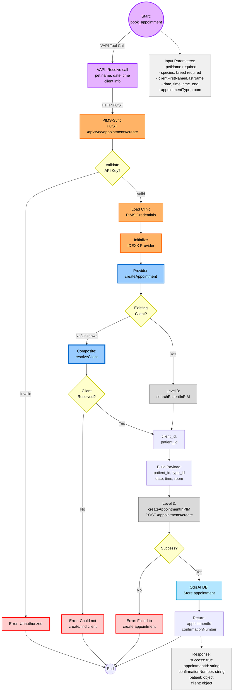
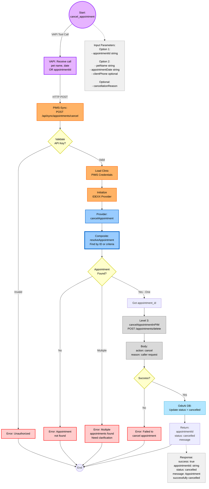

# IDEXX Appointment Management Architecture

## Overview

This document provides comprehensive architecture documentation for IDEXX Neo appointment management workflows. The system implements a **4-level architecture** that separates concerns from voice AI entry points through orchestration, business logic, and atomic API operations.

## Table of Contents

1. [Architecture Overview](#architecture-overview)
2. [4-Level Architecture](#4-level-architecture)
3. [Workflows](#workflows)
   - [Create Appointment](#create-appointment)
   - [Cancel Appointment](#cancel-appointment)
   - [Reschedule Appointment](#reschedule-appointment)
   - [Confirm Appointment](#confirm-appointment)
4. [Composite Submodules](#composite-submodules)
   - [resolveClient](#resolveclient)
   - [resolveAppointment](#resolveappointment)
5. [Provider Methods](#provider-methods)
6. [Atomic Operations](#atomic-operations)
7. [Error Handling](#error-handling)
8. [Data Flow](#data-flow)

---

## Architecture Overview

```mermaid
graph TB
    %% Level 0: VAPI Tool Calls (Entry Point)
    subgraph Level0["Level 0: VAPI Tool Calls (Entry Point)"]
        V1((book_appointment))
        V2((cancel_appointment))
        V3((reschedule_appointment))
        V4((confirm_appointment))
    end

    %% Level 1: PIMS-Sync Service Endpoints
    subgraph Level1["Level 1: PIMS-Sync Service Endpoints (Orchestration)"]
        P1[POST /api/sync/appointments/create]
        P2[POST /api/sync/appointments/cancel]
        P3[POST /api/sync/appointments/reschedule]
        P4[POST /api/sync/appointments/confirm]
    end

    %% Level 2: IDEXX Provider Methods
    subgraph Level2["Level 2: IDEXX Provider Methods (Business Logic)"]
        PR1[createAppointment]
        PR2[cancelAppointment]
        PR3[rescheduleAppointment]
        PR4[searchAppointment]
        
        subgraph Composites["Composite Submodules"]
            RC[resolveClient]
            RA[resolveAppointment]
        end
    end

    %% Level 3: Atomic IDEXX API Operations
    subgraph Level3["Level 3: Atomic IDEXX API Operations (Playwright)"]
        subgraph ClientOps["Client Operations"]
            C1[clientSearch]
            C2[clientDuplicateCheck]
            C3[createClientInPIM]
        end
        
        subgraph PatientOps["Patient Operations"]
            PT1[searchPatientInPIM]
            PT2[createPatientInPIM]
            PT3[getPatientDetails]
        end
        
        subgraph AppointmentOps["Appointment Operations"]
            A1[getAppointment]
            A2[getAppointmentView]
            A3[createAppointmentInPIM]
            A4[cancelAppointmentInPIM]
            A5[deleteAppointmentInPIM]
        end
    end

    %% OdisAI Database (Parallel Operations)
    subgraph Database["OdisAI Database"]
        DB1[Store/Update Client]
        DB2[Store/Update Patient]
        DB3[Store/Update Appointment]
        DB4[Audit Logs]
    end

    %% Level 0 to Level 1 connections
    V1 -->|HTTP POST| P1
    V2 -->|HTTP POST| P2
    V3 -->|HTTP POST| P3
    V4 -->|HTTP POST| P4

    %% Level 1 to Level 2 connections
    P1 -->|Initialize & Call| PR1
    P2 -->|Initialize & Call| PR2
    P3 -->|Initialize & Call| PR3
    P4 -->|Initialize & Call| PR4

    %% Level 2 Provider Methods use Composites
    PR1 -.->|Uses| RC
    PR2 -.->|Uses| RA
    PR3 -.->|Uses| RA
    PR4 -.->|Uses| RA

    %% Level 2 to Level 3 connections
    PR1 -->|Calls| A3
    PR2 -->|Calls| A4
    PR3 -->|Calls| A4
    PR3 -->|Calls| A3
    PR4 -->|Calls| A1

    %% Composite Submodules to Atomic Operations
    RC -.->|Searches| C1
    RC -.->|Checks| C2
    RC -.->|Creates| C3
    RC -.->|Searches| PT1
    RC -.->|Creates| PT2
    
    RA -.->|Searches| PT1
    RA -.->|Gets| A1
    RA -.->|Queries| A2

    %% Database connections (dotted for async/parallel)
    C3 -.->|Store| DB1
    PT2 -.->|Store| DB2
    A3 -.->|Store| DB3
    A4 -.->|Update| DB3
    P1 -.->|Audit| DB4
    P2 -.->|Audit| DB4
    P3 -.->|Audit| DB4
    P4 -.->|Audit| DB4

    %% Styling
    classDef vapiStyle fill:#E6B3FF,stroke:#9933FF,stroke-width:3px,color:#000
    classDef pimsStyle fill:#FFB366,stroke:#FF6600,stroke-width:2px,color:#000
    classDef providerStyle fill:#99CCFF,stroke:#0066CC,stroke-width:2px,color:#000
    classDef compositeStyle fill:#99CCFF,stroke:#0066CC,stroke-width:4px,color:#000
    classDef atomicStyle fill:#D9D9D9,stroke:#666666,stroke-width:1px,color:#000
    classDef dbStyle fill:#B3E6FF,stroke:#0099CC,stroke-width:1px,color:#000

    class V1,V2,V3,V4 vapiStyle
    class P1,P2,P3,P4 pimsStyle
    class PR1,PR2,PR3,PR4 providerStyle
    class RC,RA compositeStyle
    class C1,C2,C3,PT1,PT2,PT3,A1,A2,A3,A4,A5 atomicStyle
    class DB1,DB2,DB3,DB4 dbStyle
```



### Visual Legend

- **Purple Circles**: Level 0 - VAPI Tool Calls (Entry Point)
- **Orange Rounded Rectangles**: Level 1 - PIMS-Sync Service Endpoints (Orchestration)
- **Blue Rectangles**: Level 2 - IDEXX Provider Methods (Business Logic)
- **Blue Rectangles (Thick Border)**: Level 2 - Composite Submodules (Reusable Logic)
- **Gray Rectangles**: Level 3 - Atomic IDEXX API Operations (Playwright)
- **Light Blue Rectangles**: OdisAI Database (Parallel Operations)

### Data Flow Patterns

- **Solid arrows**: Primary execution flow
- **Dashed arrows**: Composite submodule usage
- **Dotted arrows**: Async/parallel database operations

---

## 4-Level Architecture

### Level 0: VAPI Tool Calls (Entry Point)

Voice AI assistant receives commands from callers:

- **`book_appointment`** - VAPI tool call to book appointment
- **`cancel_appointment`** - VAPI tool call to cancel appointment
- **`reschedule_appointment`** - VAPI tool call to reschedule appointment
- **`confirm_appointment`** - VAPI tool call to search/confirm appointment

**Current State:** These tools currently just LOG to `inbound_vapi_calls` table

**Target State:** These will call PIMS-Sync service to actually execute operations in IDEXX

**Location:** 
- Schemas: `libs/integrations/vapi/src/inbound-tools/schemas.ts`
- Endpoints: `apps/web/src/app/api/vapi/appointments/*` (to be created for cancel/reschedule)

### Level 1: PIMS-Sync Service Endpoints (Orchestration Layer)

HTTP API endpoints in `apps/pims-sync` that orchestrate workflows:

- **`POST /api/sync/appointments/create`** - Create appointment in PIMS
- **`POST /api/sync/appointments/cancel`** - Cancel appointment in PIMS
- **`POST /api/sync/appointments/reschedule`** - Reschedule appointment in PIMS
- **`POST /api/sync/appointments/confirm`** - Search and verify appointment

**Authentication:** API key authentication (same as existing sync endpoints)

**Responsibilities:**
- Validate request payload
- Load clinic PIMS credentials
- Initialize IDEXX provider
- Call provider methods
- Handle errors and fallbacks
- Return structured response

**Location:** `apps/pims-sync/src/routes/appointments.route.ts` (to be created)

### Level 2: IDEXX Provider Methods (Business Logic + Composite Operations)

Provider methods in `libs/integrations/idexx` that implement business logic:

**Primary Methods:**
- **`createAppointment(input)`** - Uses `resolveClient` + `createAppointmentInPIM`
- **`cancelAppointment(input)`** - Uses `resolveAppointment` + `cancelAppointmentInPIM`
- **`rescheduleAppointment(input)`** - Uses `resolveAppointment` + cancel + create (atomic)
- **`searchAppointment(input)`** - Uses `resolveAppointment` to find by criteria

**Composite Submodules (reusable across methods):**
- **`resolveClient(input)`** - Handle client existence check, search, or creation with patient
- **`resolveAppointment(criteria)`** - Search for appointment by various criteria (pet name + date, appointment ID)

**Location:** `libs/integrations/idexx/src/provider/appointment-management-client.ts`

### Level 3: Atomic IDEXX API Operations (Playwright)

Low-level Playwright operations that make HTTP calls to IDEXX Neo:

**Client Operations:**
- `clientSearch(searchTerm)` - GET `/clients/search`
- `clientDuplicateCheck(firstName, lastName, phone)` - GET `/clients/duplicateCheck`
- `createClientInPIM(clientData)` - POST `/clients/create`

**Patient Operations:**
- `searchPatientInPIM(query)` - GET `/search/patients`
- `createPatientInPIM(patientData)` - POST `/patients/create`
- `getPatientDetails(patientId)` - GET `/patients/getPatient/{id}`

**Appointment Operations:**
- `getAppointment(appointmentId)` - GET `/appointments/getAppointment?id={id}`
- `getAppointmentView()` - GET `/appointments/getAppointmentView` (lookup: types, rooms, providers)
- `createAppointmentInPIM(data)` - POST `/appointments/create` (multipart/form-data)
- `cancelAppointmentInPIM(appointmentId, reason)` - POST `/appointments/delete/{id}` with `{"action": "cancel", "reason": "..."}`
- `deleteAppointmentInPIM(appointmentId)` - POST `/appointments/delete/{id}` with `{"action": "delete"}`

**Location:** `libs/integrations/idexx/src/provider/appointment-management-client.ts` (private methods)

---

## Workflows

### Create Appointment



**Overview:** Creates a new appointment in IDEXX Neo for a pet. Handles both existing and new clients through the `resolveClient` composite submodule.

**Input Parameters:**

```typescript
{
  // Pet information
  petName: string;           // required
  species: string;           // required
  breed: string;             // required
  
  // Client information (if new)
  clientFirstName?: string;  // required if isNewClient
  clientLastName?: string;   // required if isNewClient
  phone?: string;            // optional
  email?: string;            // optional
  
  // Appointment details
  appointmentDate: string;   // required - ISO format
  time: string;              // required - HH:mm
  time_end: string;          // required - HH:mm
  appointmentType: string;   // required - type_id
  room: string;              // required - room_id
  provider?: string;         // optional - user_id
  
  // VAPI context
  clinic_id: string;         // required
  vapi_call_id?: string;     // optional
  assistant_id?: string;     // optional
}
```

**Response Format:**

```typescript
{
  success: true,
  data: {
    appointmentId: string,
    confirmationNumber: string,
    appointment: {
      id: string,
      date: string,
      time: string,
      timeEnd: string
    },
    patient: {
      id: string,
      name: string,
      breed: string,
      species: string
    },
    client: {
      id: string,
      firstName: string,
      lastName: string,
      phone: string
    }
  }
}
```

**Error Handling:**

| Error Scenario | Response |
|----------------|----------|
| Invalid API Key | 401 Unauthorized |
| Client Creation Failed | 500 with error message |
| Patient Not Found | 404 - offer to create new client |
| Appointment Slot Conflict | 409 with conflicting appointment details |
| Playwright Timeout | 504 Gateway Timeout - retry logic |

---

### Cancel Appointment



**Overview:** Cancels an existing appointment in IDEXX Neo. Uses `resolveAppointment` composite to find the appointment by various criteria (ID, pet name + date).

**Input Parameters:**

```typescript
{
  // Option 1: Direct ID lookup
  appointmentId?: string;    // if known
  
  // Option 2: Search criteria
  petName?: string;          // required if no appointmentId
  appointmentDate?: string;  // required if no appointmentId (ISO format)
  clientPhone?: string;      // optional - for disambiguation
  clientName?: string;       // optional - for disambiguation
  
  // Cancellation details
  cancellationReason?: string;  // optional - default: "Caller requested"
  
  // VAPI context
  clinic_id: string;         // required
  vapi_call_id?: string;     // optional
  assistant_id?: string;     // optional
}
```

**Response Format:**

```typescript
{
  success: true,
  data: {
    appointmentId: string,
    status: "cancelled",
    cancelledAt: string,      // ISO timestamp
    reason: string,
    appointment: {
      id: string,
      date: string,
      time: string,
      patient: {
        name: string,
        breed: string
      },
      client: {
        name: string,
        phone: string
      }
    }
  },
  message: "Appointment successfully cancelled"
}
```

**Design Notes:**

1. **Soft Delete**: Uses `action: "cancel"` instead of `action: "delete"` to preserve appointment history
2. **Disambiguation**: If multiple appointments match criteria, returns list to caller
3. **Idempotency**: If appointment already cancelled, returns success with existing cancellation details
4. **Audit Trail**: All cancellations logged with timestamp, reason, and VAPI call context

---

### Reschedule Appointment

```mermaid
graph TB
    Start((Start:<br/>reschedule_appointment))
    
    %% Level 0: VAPI
    Start -->|VAPI Tool Call| L0[VAPI: Receive call<br/>old appointment info<br/>new date/time]
    
    %% Level 1: PIMS-Sync
    L0 -->|HTTP POST| L1[PIMS-Sync:<br/>POST /api/sync/appointments/reschedule]
    L1 --> Auth{Validate<br/>API Key?}
    Auth -->|Invalid| AuthErr[Error: Unauthorized]
    Auth -->|Valid| LoadCreds[Load Clinic<br/>PIMS Credentials]
    LoadCreds --> InitProvider[Initialize<br/>IDEXX Provider]
    
    %% Level 2: Provider
    InitProvider --> Provider[Provider:<br/>rescheduleAppointment]
    Provider --> ResolveOld[Composite:<br/>resolveAppointment<br/>Find original appointment]
    
    ResolveOld --> OldFound{Original<br/>Found?}
    OldFound -->|No| NotFoundErr[Error: Original<br/>appointment not found]
    OldFound -->|Yes| StoreBackup[Store old appointment<br/>data for rollback]
    
    StoreBackup --> BeginTxn[BEGIN ATOMIC<br/>TRANSACTION]
    
    %% Level 3: Cancel old appointment
    BeginTxn --> CancelOld[Level 3:<br/>cancelAppointmentInPIM<br/>old_id, reason: Rescheduled]
    CancelOld --> CancelSuccess{Cancel<br/>Success?}
    CancelSuccess -->|No| Rollback1[ABORT:<br/>Return error]
    
    %% Level 3: Create new appointment
    CancelSuccess -->|Yes| CreateNew[Level 3:<br/>createAppointmentInPIM<br/>new date/time/details]
    CreateNew --> CreateSuccess{Create<br/>Success?}
    CreateSuccess -->|No| Rollback2[ROLLBACK:<br/>Re-create old<br/>appointment]
    Rollback2 --> RollbackErr[Error: Reschedule failed<br/>Original restored]
    
    CreateSuccess -->|Yes| CommitTxn[COMMIT<br/>TRANSACTION]
    
    %% Database operations
    CommitTxn --> UpdateDB[OdisAI DB:<br/>Link old_id → new_id<br/>Status: rescheduled]
    
    UpdateDB --> Return[Return:<br/>oldAppointmentId<br/>newAppointmentId<br/>status: rescheduled]
    Return --> End((End))
    
    %% Error paths
    AuthErr --> End
    NotFoundErr --> End
    Rollback1 --> End
    RollbackErr --> End
    
    %% Note boxes
    note1[Input Parameters:<br/>Original Appointment:<br/>- appointmentId OR<br/>- petName + originalDate<br/><br/>New Appointment:<br/>- newDate required<br/>- newTime required<br/>- newTime_end required<br/>- newRoom optional<br/>- newProvider optional<br/>- newType optional]
    note2[Response:<br/>success: true<br/>oldAppointmentId: string<br/>newAppointmentId: string<br/>status: rescheduled<br/>oldAppointment: object<br/>newAppointment: object]
    note3[ATOMIC TRANSACTION:<br/>Cancel + Create must<br/>both succeed or both fail<br/>Rollback restores<br/>original appointment]
    
    Start -.-> note1
    Return -.-> note2
    BeginTxn -.-> note3
    
    %% Styling
    classDef vapiStyle fill:#E6B3FF,stroke:#9933FF,stroke-width:3px,color:#000
    classDef pimsStyle fill:#FFB366,stroke:#FF6600,stroke-width:2px,color:#000
    classDef providerStyle fill:#99CCFF,stroke:#0066CC,stroke-width:2px,color:#000
    classDef compositeStyle fill:#99CCFF,stroke:#0066CC,stroke-width:4px,color:#000
    classDef atomicStyle fill:#D9D9D9,stroke:#666666,stroke-width:1px,color:#000
    classDef dbStyle fill:#B3E6FF,stroke:#0099CC,stroke-width:1px,color:#000
    classDef decisionStyle fill:#FFFFCC,stroke:#CCCC00,stroke-width:2px,color:#000
    classDef errorStyle fill:#FFCCCC,stroke:#FF0000,stroke-width:2px,color:#000
    classDef noteStyle fill:#F0F0F0,stroke:#999999,stroke-width:1px,color:#000
    classDef transactionStyle fill:#FFEBCC,stroke:#FF9900,stroke-width:3px,color:#000
    
    class Start vapiStyle
    class L0 vapiStyle
    class L1,LoadCreds,InitProvider pimsStyle
    class Provider,StoreBackup providerStyle
    class ResolveOld compositeStyle
    class CancelOld,CreateNew atomicStyle
    class UpdateDB dbStyle
    class Auth,OldFound,CancelSuccess,CreateSuccess decisionStyle
    class AuthErr,NotFoundErr,Rollback1,Rollback2,RollbackErr errorStyle
    class note1,note2,note3 noteStyle
    class BeginTxn,CommitTxn transactionStyle
```



**Overview:** Reschedules an existing appointment to a new date/time. Implemented as an **atomic transaction**: cancel old appointment + create new appointment. If creation fails, the original appointment is restored (rollback).

**Input Parameters:**

```typescript
{
  // Original appointment identification
  appointmentId?: string;       // if known
  petName?: string;             // required if no appointmentId
  originalDate?: string;        // required if no appointmentId (ISO)
  originalTime?: string;        // optional - for disambiguation
  
  // New appointment details (required)
  newDate: string;              // required - ISO format
  newTime: string;              // required - HH:mm
  newTime_end: string;          // required - HH:mm
  
  // Optional overrides (defaults to original values)
  newRoom?: string;             // optional - room_id
  newProvider?: string;         // optional - user_id
  newType?: string;             // optional - type_id
  
  // Metadata
  reason?: string;              // optional - reschedule reason
  
  // VAPI context
  clinic_id: string;            // required
  vapi_call_id?: string;        // optional
  assistant_id?: string;        // optional
}
```

**Response Format:**

```typescript
{
  success: true,
  data: {
    oldAppointmentId: string,
    newAppointmentId: string,
    status: "rescheduled",
    oldAppointment: {
      id: string,
      date: string,
      time: string,
      cancelledAt: string,
      reason: "Rescheduled"
    },
    newAppointment: {
      id: string,
      date: string,
      time: string,
      timeEnd: string,
      patient: {
        id: string,
        name: string
      },
      client: {
        id: string,
        name: string
      }
    }
  },
  message: "Appointment successfully rescheduled"
}
```

**Design Notes:**

1. **Atomic Transaction**: Cancel and create must both succeed or both fail
2. **Rollback Strategy**: If new appointment creation fails, immediately recreate the original appointment
3. **Data Preservation**: All original appointment details stored before cancellation
4. **Idempotency**: If reschedule is retried with same parameters, detect and return existing result
5. **Audit Trail**: Both operations logged separately with link between old and new appointments
6. **Future Enhancement**: If IDEXX adds native reschedule API, replace cancel + create with single update operation

---

### Confirm Appointment

```mermaid
graph TB
    Start((Start:<br/>confirm_appointment))
    
    %% Level 0: VAPI
    Start -->|VAPI Tool Call<br/>Implicit during call| L0[VAPI: Receive query<br/>pet name, date<br/>client info optional]
    
    %% Level 1: PIMS-Sync
    L0 -->|HTTP POST| L1[PIMS-Sync:<br/>POST /api/sync/appointments/confirm]
    L1 --> Auth{Validate<br/>API Key?}
    Auth -->|Invalid| AuthErr[Error: Unauthorized]
    Auth -->|Valid| LoadCreds[Load Clinic<br/>PIMS Credentials]
    LoadCreds --> InitProvider[Initialize<br/>IDEXX Provider]
    
    %% Level 2: Provider
    InitProvider --> Provider[Provider:<br/>searchAppointment]
    Provider --> ResolveAppt[Composite:<br/>resolveAppointment<br/>Search by criteria]
    
    ResolveAppt --> Found{Appointments<br/>Found?}
    Found -->|None| NotFound[Return:<br/>found: false<br/>message: No appt found]
    Found -->|Multiple| Multiple[Return:<br/>multiple: true<br/>appointments: array]
    Found -->|One| GetDetails[Level 3:<br/>getAppointment<br/>Fetch full details]
    
    %% Level 3: Get full appointment details
    GetDetails --> Success{Success?}
    Success -->|No| FetchErr[Error: Could not<br/>retrieve details]
    Success -->|Yes| BuildResponse[Build Response:<br/>appointment object<br/>with all details]
    
    BuildResponse --> Return[Return:<br/>found: true<br/>appointment: full object]
    Return --> End((End))
    
    %% Special case paths
    NotFound --> End
    Multiple --> AskClarify[VAPI: Ask caller<br/>to clarify:<br/>Which time? provider?]
    AskClarify --> End
    
    %% Error paths
    AuthErr --> End
    FetchErr --> End
    
    %% Note boxes
    note1[Input Parameters:<br/>- petName required<br/>- appointmentDate required<br/><br/>Optional for disambiguation:<br/>- clientName string<br/>- clientPhone string<br/>- appointmentTime string]
    note2[Response - Single Found:<br/>found: true<br/>appointment:<br/>  id, date, time<br/>  patient: name, breed<br/>  client: name, phone<br/>  provider: name<br/>  room: name<br/>  type: name]
    note3[Response - Multiple:<br/>found: true<br/>multiple: true<br/>appointments: [<br/>  id, date, time<br/>  provider, room<br/>]<br/>VAPI asks: Which one?]
    note4[Response - None:<br/>found: false<br/>message:<br/>No appointment found<br/>for Fluffy on 2026-02-15]
    
    Start -.-> note1
    Return -.-> note2
    Multiple -.-> note3
    NotFound -.-> note4
    
    %% Styling
    classDef vapiStyle fill:#E6B3FF,stroke:#9933FF,stroke-width:3px,color:#000
    classDef pimsStyle fill:#FFB366,stroke:#FF6600,stroke-width:2px,color:#000
    classDef providerStyle fill:#99CCFF,stroke:#0066CC,stroke-width:2px,color:#000
    classDef compositeStyle fill:#99CCFF,stroke:#0066CC,stroke-width:4px,color:#000
    classDef atomicStyle fill:#D9D9D9,stroke:#666666,stroke-width:1px,color:#000
    classDef decisionStyle fill:#FFFFCC,stroke:#CCCC00,stroke-width:2px,color:#000
    classDef errorStyle fill:#FFCCCC,stroke:#FF0000,stroke-width:2px,color:#000
    classDef noteStyle fill:#F0F0F0,stroke:#999999,stroke-width:1px,color:#000
    classDef successStyle fill:#CCFFCC,stroke:#00CC00,stroke-width:2px,color:#000
    
    class Start vapiStyle
    class L0,AskClarify vapiStyle
    class L1,LoadCreds,InitProvider pimsStyle
    class Provider,BuildResponse providerStyle
    class ResolveAppt compositeStyle
    class GetDetails atomicStyle
    class Auth,Found,Success decisionStyle
    class AuthErr,FetchErr errorStyle
    class note1,note2,note3,note4 noteStyle
    class Return,NotFound,Multiple successStyle
```

**Overview:** Searches for and confirms an existing appointment in IDEXX Neo. Used during voice calls when a caller inquires about their appointment details. Handles single result, multiple results (disambiguation), and no results cases.

**Input Parameters:**

```typescript
{
  // Required search criteria
  petName: string;           // required
  appointmentDate: string;   // required - ISO format or natural language
  
  // Optional disambiguation fields
  clientName?: string;       // helps narrow down if multiple pets named "Max"
  clientPhone?: string;      // helps identify correct client
  appointmentTime?: string;  // HH:mm - if caller mentions time
  
  // VAPI context
  clinic_id: string;         // required
  vapi_call_id?: string;     // optional
  assistant_id?: string;     // optional
}
```

**Response Formats:**

**Single Appointment Found:**
```typescript
{
  success: true,
  data: {
    found: true,
    multiple: false,
    appointment: {
      id: string,
      date: string,
      time: string,
      timeEnd: string,
      patient: { name, breed, species },
      client: { firstName, lastName, phone },
      provider: { name },
      room: { name },
      type: { name }
    }
  }
}
```

**Multiple Appointments Found:**
```typescript
{
  success: true,
  data: {
    found: true,
    multiple: true,
    appointments: [
      {
        id: string,
        date: string,
        time: string,
        provider: { name },
        room: { name }
      }
    ]
  },
  message: "Multiple appointments found. Please specify which one."
}
```

**Design Notes:**

1. **Non-Destructive**: This is a read-only operation, no changes to appointments
2. **Flexible Search**: Accepts various date formats (2026-02-15, "this Friday", "next Monday")
3. **Disambiguation Strategy**: Returns partial details for multiple results to help caller identify correct appointment
4. **Performance**: Can cache common lookups to reduce IDEXX API calls
5. **Privacy**: Only returns appointment details if pet name + date match (prevents unauthorized access)

---

## Composite Submodules

### resolveClient

**Purpose:** Handle client existence check, search, or creation with patient. This composite submodule eliminates code duplication across multiple workflows.

**Flow:**

1. **Check for Duplicate Client**
   - Call `clientDuplicateCheck(firstName, lastName, phone)`
   - If found: Return existing `client_id`

2. **Create Client (if not found)**
   - Call `createClientInPIM(clientData)`
   - Store in OdisAI database
   - Return new `client_id`

3. **Check/Create Patient**
   - Search for patient by name within client
   - If not found: Call `createPatientInPIM(patientData)`
   - Store in OdisAI database
   - Return `patient_id`

**Input:**

```typescript
{
  // Client info
  clientFirstName: string;
  clientLastName: string;
  phone?: string;
  email?: string;
  
  // Pet info
  petName: string;
  species: string;
  breed: string;
  gender?: string;
  dateOfBirth?: string;
}
```

**Output:**

```typescript
{
  client_id: string;
  patient_id: string;
  isNewClient: boolean;
  isNewPatient: boolean;
}
```

**Error Cases:**

- Client creation failed → Return error with details
- Patient creation failed → Return error, client may be orphaned (log for review)
- Duplicate check timeout → Retry once, then fail gracefully

---

### resolveAppointment

**Purpose:** Search for appointment by various criteria (pet name + date, appointment ID). Handles multiple results and not found cases.

**Flow:**

1. **If `appointmentId` provided:**
   - Direct lookup via `getAppointment(appointmentId)`
   - Return appointment data or error

2. **If search criteria provided:**
   - Search patient by name: `searchPatientInPIM(petName)`
   - If patient not found: Return error
   - Query appointments by `patient_id + date`
   - Handle results:
     - **None**: Return "not found"
     - **One**: Return appointment data
     - **Multiple**: Return list for disambiguation

**Input:**

```typescript
{
  // Option 1: Direct lookup
  appointmentId?: string;
  
  // Option 2: Search criteria
  petName?: string;
  appointmentDate?: string;
  clientPhone?: string;      // optional - for disambiguation
  clientName?: string;         // optional - for disambiguation
}
```

**Output:**

```typescript
// Single result
{
  found: true;
  appointment_id: string;
  appointment_data: {
    id: string;
    date: string;
    time: string;
    patient: object;
    client: object;
    provider: object;
    room: object;
  };
}

// Multiple results
{
  found: true;
  multiple: true;
  appointments: Array<{
    id: string;
    date: string;
    time: string;
    provider: string;
    room: string;
  }>;
}

// Not found
{
  found: false;
  error: "APPOINTMENT_NOT_FOUND";
}
```

**Error Cases:**

- Patient not found → Return error with helpful message
- Multiple appointments → Return list for caller to clarify
- Appointment lookup failed → Return error with retry suggestion

---

## Provider Methods

### createAppointment

**Location:** `libs/integrations/idexx/src/provider/appointment-management-client.ts`

**Key Decision Points:**

1. **New vs Existing Client**
   - If `isNewClient=true` OR `client_id` missing: Use `resolveClient` composite
   - If `client_id` provided: Direct patient search

2. **Patient Identification**
   - New Client Path: Patient created as part of `resolveClient`
   - Existing Client Path: Search for patient by name within client's records
   - Edge Case: Multiple patients with same name → error, ask for clarification

3. **Optional Slot Validation**
   - Can query IDEXX Neo to check if time slot is available
   - Prevents double-booking in high-volume clinics
   - Configurable per clinic (some prefer optimistic booking)

**Atomic Operations Used:**

- `searchPatientInPIM(petName, client_id)` - GET `/search/patients`
- `getAppointmentView()` - GET `/appointments/getAppointmentView` (optional slot check)
- `createAppointmentInPIM(payload)` - POST `/appointments/create` (multipart/form-data)

**Response Structure:**

```typescript
interface AppointmentOperationResult {
  success: boolean;
  appointmentId?: string;
  confirmationNumber?: string;
  appointment?: {
    id: string;
    date: string;
    time: string;
    timeEnd: string;
    type: { id: string; name: string };
    room: { id: string; name: string };
    provider?: { id: string; name: string };
  };
  patient?: { id: string; name: string; breed: string; species: string };
  client?: { id: string; firstName: string; lastName: string; phone: string };
  error?: string;
  errorCode?: string;
}
```

---

### cancelAppointment

**Location:** `libs/integrations/idexx/src/provider/appointment-management-client.ts`

**Key Decision Points:**

1. **Appointment Identification**
   - Option 1: Direct lookup by `appointmentId` (fastest)
   - Option 2: Search by `petName + date` (+ optional `clientPhone` for disambiguation)

2. **Already Cancelled Check**
   - If appointment already cancelled, return success (idempotent operation)
   - Prevents duplicate cancellation logs and notifications

3. **Cancellation Reason**
   - If provided: Use caller's reason
   - If not provided: Default to "Caller requested cancellation"

4. **Cancel vs Delete**
   - Uses `action: "cancel"` (soft delete) to preserve history
   - Hard delete (`action: "delete"`) only used in rare cases (admin cleanup)

**Atomic Operations Used:**

- `cancelAppointmentInPIM(appointmentId, reason)` - POST `/appointments/delete/{id}` with `{"action": "cancel", "reason": "..."}`

**Idempotency Handling:**

If the same cancellation request is made multiple times:
1. Check if appointment already has `status = 'cancelled'`
2. If yes, return existing cancellation details as success
3. Do NOT make duplicate API call to IDEXX
4. Do NOT create duplicate audit log entry

---

### rescheduleAppointment

**Location:** `libs/integrations/idexx/src/provider/appointment-management-client.ts`

**Key Design:** Implemented as atomic transaction (cancel + create). Both operations must succeed or both fail.

**Transaction Flow:**

1. **Find Original Appointment**
   - Use `resolveAppointment` to find appointment
   - Store complete appointment data for potential rollback

2. **Begin Atomic Transaction**
   - **Step 1**: Cancel old appointment
     - Call `cancelAppointmentInPIM` with reason "Rescheduled"
     - If fails: Abort and return error
   - **Step 2**: Create new appointment
     - Reuse `patient_id`, `type_id` (unless overridden)
     - Use new date, time, time_end (required)
     - If fails: **Rollback** - recreate original appointment
   - **Step 3**: Commit
     - If both succeed, link old and new appointments in database

**Rollback Strategy:**

If new appointment creation fails:
1. Immediately recreate original appointment with same details
2. Return error indicating reschedule failed but original restored
3. Log rollback event for audit trail

**Future Enhancement:** If IDEXX adds native reschedule API, replace cancel + create with single update operation.

---

### searchAppointment

**Location:** `libs/integrations/idexx/src/provider/appointment-management-client.ts`

**Purpose:** Search for appointments by various criteria. Used for confirmation workflow.

**Flow:**

1. Use `resolveAppointment` composite to search by criteria
2. Handle three result scenarios:
   - **No Results**: Return "not found" message
   - **Multiple Results**: Return list of appointments for caller to clarify
   - **Single Result**: Fetch full details via `getAppointment` and return

**Atomic Operations Used:**

- `searchPatientInPIM(petName)` - GET `/search/patients`
- `getAppointment(appointmentId)` - GET `/appointments/getAppointment?id={id}`

---

## Atomic Operations

### Client Operations

**clientSearch(searchTerm)**
- Endpoint: GET `/clients/search?q={searchTerm}`
- Purpose: Search for clients by name or phone
- Returns: Array of matching clients

**clientDuplicateCheck(firstName, lastName, phone)**
- Endpoint: GET `/clients/duplicateCheck?firstName={fname}&lastName={lname}&phone={phone}`
- Purpose: Check if client already exists before creation
- Returns: Boolean or existing client data

**createClientInPIM(clientData)**
- Endpoint: POST `/clients/create`
- Purpose: Create new client in IDEXX Neo
- Payload: `{ firstName, lastName, phone, email, address, ... }`
- Returns: Created client object with `id`

### Patient Operations

**searchPatientInPIM(query)**
- Endpoint: GET `/search/patients?q={query}&includeInactive=false&json=true&suggested=true&limit=100`
- Purpose: Search for patients by name (autocomplete)
- Returns: Array of matching patients with client info

**createPatientInPIM(patientData)**
- Endpoint: POST `/patients/create`
- Purpose: Create new patient in IDEXX Neo
- Payload: `{ name, species, breed, gender, dateOfBirth, clientId, ... }`
- Returns: Created patient object with `id`

**getPatientDetails(patientId)**
- Endpoint: GET `/patients/getPatient/{id}`
- Purpose: Get full patient details
- Returns: Complete patient object

### Appointment Operations

**getAppointment(appointmentId)**
- Endpoint: GET `/appointments/getAppointment?id={id}`
- Purpose: Get single appointment details
- Returns: Complete appointment object with patient, client, provider, room, type

**getAppointmentView()**
- Endpoint: GET `/appointments/getAppointmentView`
- Purpose: Get lookup data (appointment types, rooms, providers)
- Returns: Object with arrays of available types, rooms, providers
- Used for: Slot availability checking, form dropdowns

**createAppointmentInPIM(data)**
- Endpoint: POST `/appointments/create`
- Method: multipart/form-data
- Purpose: Create new appointment
- Payload:
  ```
  patient_id: number
  type_id: number
  user_id?: number
  room: string
  appointment_date: string (YYYY-MM-DD)
  time: string (HH:mm)
  time_end: string (HH:mm)
  notes?: string
  ```
- Returns: Created appointment object with `id` and confirmation number

**cancelAppointmentInPIM(appointmentId, reason)**
- Endpoint: POST `/appointments/delete/{id}`
- Purpose: Cancel appointment (soft delete)
- Payload: `{ "action": "cancel", "reason": "..." }`
- Returns: Success status
- Note: Uses `action: "cancel"` to preserve history (soft delete)

**deleteAppointmentInPIM(appointmentId)**
- Endpoint: POST `/appointments/delete/{id}`
- Purpose: Hard delete appointment (rare, admin only)
- Payload: `{ "action": "delete" }`
- Returns: Success status
- Note: Hard delete removes appointment completely (use sparingly)

---

## Error Handling

### Error Types

| Error Code | Description | Handler Action |
|------------|-------------|----------------|
| `INVALID_INPUT` | Missing or invalid required fields | Return error immediately with field list |
| `UNAUTHORIZED` | Invalid API key or authentication failed | Return 401, log attempt |
| `CLIENT_RESOLUTION_FAILED` | Could not resolve/create client | Return error with details, suggest manual creation |
| `PATIENT_NOT_FOUND` | Patient does not exist | Suggest creating new patient or verify pet name |
| `PATIENT_AMBIGUOUS` | Multiple patients with same name | Return list, ask caller to clarify |
| `APPOINTMENT_NOT_FOUND` | No appointment matches criteria | Return helpful message with search criteria |
| `APPOINTMENT_AMBIGUOUS` | Multiple appointments match | Return list for disambiguation |
| `SLOT_UNAVAILABLE` | Time slot already booked | Return available times |
| `IDEXX_API_ERROR` | IDEXX Neo API returned error | Log error, retry once, then fail gracefully |
| `PLAYWRIGHT_TIMEOUT` | Browser automation timed out | Retry once, then return 504 Gateway Timeout |
| `NETWORK_ERROR` | Network request failed | Retry with exponential backoff (3 attempts) |
| `ROLLBACK_FAILED` | Failed to restore original appointment | Critical error - requires manual intervention |

### Retry Strategy

**Playwright Timeouts:**
- Retry once immediately
- If still fails, return error

**Network Errors:**
- Exponential backoff: 1s, 2s, 4s
- Maximum 3 attempts
- If all fail, return error

**IDEXX API Errors:**
- Check error code:
  - 401/403: Re-authenticate, retry once
  - 429 (Rate Limit): Wait, retry with backoff
  - 500+: Log, retry once, then fail

### Graceful Degradation

**Partial Success Scenarios:**

1. **Appointment Created in IDEXX, DB Storage Failed**
   - Log for manual reconciliation
   - Return success with warning flag
   - Background job reconciles later

2. **Client Created, Patient Creation Failed**
   - Mark client as "incomplete"
   - Log for review
   - Return error with client_id for retry

3. **Reschedule: Cancel Succeeded, Create Failed**
   - Rollback: Recreate original appointment
   - Return error indicating rollback occurred
   - Log rollback event

---

## Data Flow

### Request Flow

```
VAPI Tool Call (Level 0)
  ↓ HTTP POST
PIMS-Sync Endpoint (Level 1)
  ├─ Validate API Key
  ├─ Load Clinic Credentials
  ├─ Initialize Provider
  ↓
Provider Method (Level 2)
  ├─ Use Composite Submodules (if needed)
  ├─ Orchestrate Atomic Operations
  ↓
Playwright Operations (Level 3)
  ├─ Make IDEXX API Calls
  ├─ Handle Responses
  ↓
Return Result
  ├─ Store in OdisAI DB (parallel)
  ├─ Audit Log (parallel)
  └─ Return to VAPI
```

### Database Operations (Parallel)

All database operations happen in parallel with IDEXX operations:

- **Client Creation**: Store client record in `clients` table
- **Patient Creation**: Store patient record in `patients` table, link to client
- **Appointment Creation**: Store appointment in `appointments` table, link to patient/client
- **Appointment Updates**: Update status, cancellation reason, timestamps
- **Audit Logging**: Log all operations with VAPI context (call_id, clinic_id, timestamp)

### Audit Trail

Every operation logs:

```typescript
{
  operation: 'create_appointment' | 'cancel_appointment' | 'reschedule_appointment' | 'confirm_appointment',
  clinic_id: string,
  vapi_call_id?: string,
  assistant_id?: string,
  timestamp: string,
  input: object,
  output: object,
  success: boolean,
  error?: string,
  duration_ms: number
}
```

---

## Key Design Principles

1. **Separation of Concerns**: Each level has distinct responsibilities
2. **Reusability**: Composite submodules eliminate code duplication
3. **Testability**: Each level can be tested independently
4. **Maintainability**: Changes at lower levels don't affect higher-level logic
5. **Observability**: Audit logging at orchestration layer (Level 1)
6. **Idempotency**: Operations can be safely retried
7. **Atomicity**: Reschedule operations are transactional (all or nothing)
8. **Graceful Degradation**: Partial failures handled with rollback/reconciliation

---

## Implementation Status

**Current State:**
- ✅ IDEXX API endpoints discovered and documented
- ✅ AppointmentManagementClient implemented with atomic operations
- ✅ VAPI tool schemas defined (book, cancel, reschedule, confirm)
- ⏳ PIMS-Sync endpoints (Level 1) - **To be implemented**
- ⏳ VAPI tool endpoints (cancel/reschedule) - **To be implemented**
- ⏳ Provider methods (Level 2) using composites - **To be implemented**

**Next Steps:**

1. Implement PIMS-Sync endpoints (`apps/pims-sync/src/routes/appointments.route.ts`)
2. Implement VAPI tool endpoints for cancel/reschedule (`apps/web/src/app/api/vapi/appointments/`)
3. Implement composite submodules (`resolveClient`, `resolveAppointment`) in provider
4. Add comprehensive error handling and retry logic
5. Add audit logging and monitoring
6. Write integration tests for each workflow

---

## Related Documentation

- [APPOINTMENT_API_DISCOVERY.md](./APPOINTMENT_API_DISCOVERY.md) - IDEXX API endpoint details
- [APPOINTMENT_IMPLEMENTATION_SUMMARY.md](../APPOINTMENT_IMPLEMENTATION_SUMMARY.md) - Implementation status
- [apps/pims-sync/README.md](../../../../apps/pims-sync/README.md) - PIMS-Sync service documentation
